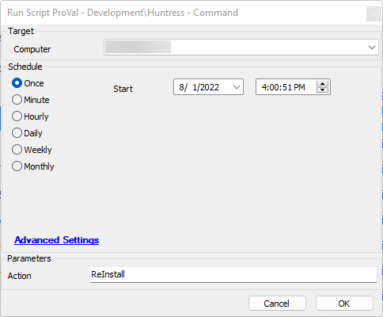

## Summary

This script takes an action parameter of 'Install', 'Uninstall', or 'ReInstall' and performs that action on the target machine.

## Sample Run

## Variables

Document the various variables in the script. Delete any section that is not relevant to your script.

| Name            | Description                                          |
|-----------------|------------------------------------------------------|
| Installed       | This is 0 (Uninstalled) or 1 (Installed),           |
| UninstallState  | This is 0 (Success) or 1 (Failed).                  |
| InstallState    | This is 0 (Success) or 1 (Failed)                   |

#### Global Parameters

| Name      | Example                       | Required          | Description                                       |
|-----------|-------------------------------|-------------------|---------------------------------------------------|
| Acct_Key  | hfdkjaldhfuinb933487fg0a     | True If installing | This is the assigned Account Key for Huntress.    |

#### User Parameters

| Name     | Example                                         | Required | Description                                         |
|----------|-------------------------------------------------|----------|-----------------------------------------------------|
| Action   | 'Install', 'UnInstall', or 'ReInstall' - Default = Install | False    | The action you wish to take with the Huntress application. |

## Process

1. Action - UnInstall or ReInstall
   1. Start Uninstall.
   2. Check for method of removal and remove.
   3. Check if still installed.
   4. Return 0 if Successfully removed, return 1 if still present. - Variable UninstallStatus, Logged.
   5. If Return is 0 and there is a 'ReInstall' action then initiate install - otherwise exit with an error.
2. Action Install - or sent to by Re-Install' action
   1. Check for account key applies 1 to InstallState if not valid and returns an error.
   2. Downloads the application for mac or windows.
   3. Executes the installer for mac or windows.
   4. Checks for the installation.
   5. Returns 0 if software is installed or 1 if Huntress is not installed.
   6. Errors out if failed.

## Output

- Script log

