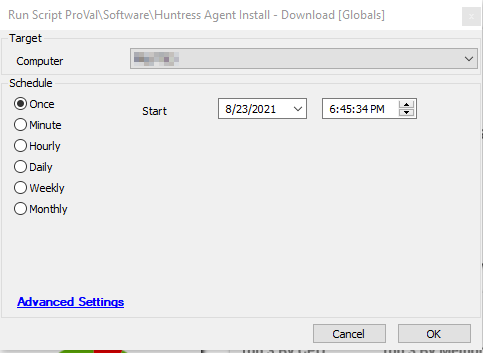

## Summary

The script downloads and installs the Huntress Agent silently on the Windows machine.

Time Saved by Automation: 10 Minutes

## Sample Run

## Variables

#### Global Parameters

| Name      | Example              | Required | Description                                                                                     |
|-----------|----------------------|----------|-------------------------------------------------------------------------------------------------|
| acct_key  | 1SA2345AASSSS234     | True     | This is the Account Key that determines which Huntress Account an Agent should be associated with. |

## Process

- Downloads the specific .exe file using the Account Key.
- Executes Batch script to install Huntress Agent on the machine.
- Stores the output of the Batch script in the variable: `@shellresult@`.

## Output

- Script log

