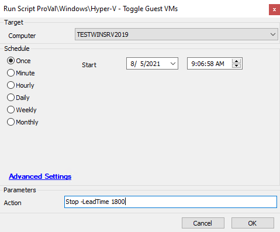

## Summary

This script starts/stops a VM on a Hyper-V system. There is an optional parameter (`-LeadTime`) to determine the number of seconds to wait for the VM to start/stop respectively.

Time Saved by Automation: 5 Minutes

## Sample Run

## Dependencies

- [Toggle-VMGuests](https://proval.itglue.com/DOC-5078775-7410870)
- Only works on Hyper-V hosts (role has to be detected)

## Variables

- `@PS1Path@` -> Location of the PowerShell script
- `@PS1Log@` -> Location of the log output file

#### User Parameters

| Parameter  | Alias | Required | Default | Type   | Description                                                                                     |
|------------|-------|----------|---------|--------|-------------------------------------------------------------------------------------------------|
| `Action`   |       | True     |         | String | The action for the script to take. Limited to `"Start"` and `"Stop"`.                        |
| `LeadTime` |       | False    | 300     | Int    | The number of seconds to wait for each VM before moving to the next or aborting.              |

## Process

The script takes a mandatory parameter (`-Action`) to determine if it is going to start or stop VMs. There is an optional parameter (`-LeadTime`) to determine the number of seconds to wait for the VM to start/stop respectively.

If stopping VMs, a SRV record DNS lookup is used to determine if any of the VMs are domain controllers. If any DCs are found, then they will be shut down last. The process then begins and the VMs begin to shut down one at a time. If any VM fails to gracefully shut down, then the process will be aborted and all VMs brought back online. An error log is written in this case. A final offline check will be performed, and the process will be aborted, all VMs booted back up, and an error log written if any VM is found to be online. If all VMs are shut down successfully then XML files of the VM objects will be written for future processing: one file for found domain controllers, and one file for all other VMs.

If starting, the files generated by the stop process will be parsed to determine the VMs to start up. If no files exist, the script will exit. Any domain controllers will be booted first. If any VM fails to start within the startup threshold, then an error log will be written, and the process will continue. Each VM will be given lead time before attempting to boot the next VM to ensure time to begin the boot process.

## Output

- Script log
- Local file on computer

