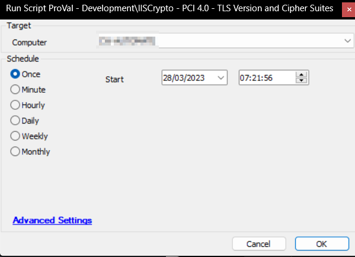

## Summary

The script downloads and runs IISCryptoCLI, applying the `pci4.0` template. The PCI 4.0 template was created and placed in the partner's LTShare.

## Requirements

Place the attached `Pci4.0_Template.ictpl` file under the "LTShare/Transfer/configs" directory as `Pci4.0_Template.ictpl` on the Automate Server. This path can be found at the WebDAV login for the hosted partners.

## Sample Run



## Dependencies

[Download IISCrypto CLI](https://www.nartac.com/Downloads/IISCrypto/IISCryptoCli.exe)

## Variables

| Name               | Description                                   |
|--------------------|-----------------------------------------------|
| ProjectName        | IISCrypto_PCI_4_0                            |
| WorkingDirectory    | C:/ProgramData/_automation/script/IISCrypto_PCI_4_0 |
| ShellResult        | Output of the command applying the template    |

## Output

### Script Logs

**Expected Output:**

```
IIS Crypto CLI 3.3

Created by Nartac Software Inc.  www.nartac.com
Copyright (c) 2011-2022 Nartac Software Inc.

Registry exported to file: C:/ProgramData/_automation/script/IISCrypto_PCI_4_0/IISCrypto_PCI_4_0Backup.reg
Template applied: PCI 4.0
```
## Attachments
[Pci4.0_Template.ictpl](<..\..\..\static\attachments\itg\12486318\Pci4.0_Template.ictpl>)
