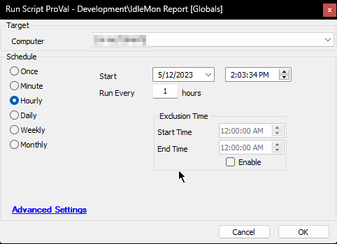

## Summary

The script collects the idle time of the user(s) logged on to a Windows machine. The data is then stored in a custom table for the number of days specified in the global variable `ThresholdDays`.

It uses the [IdleMon](https://proval.itglue.com/DOC-5078775-12641582) tool to fetch the data.

The tool must be placed in the `Utilities` folder at `LTShare//Transfer` on the Automate Server/WebDav.

The logged-in user must re-login after installing the tool. The script will install the tool on the first run, and then the user must re-login; otherwise, it will not be able to collect data.

## Sample Run

Schedule the script to run periodically against the computer to monitor.

## Dependencies

The [IdleMon](https://proval.itglue.com/DOC-5078775-12641582) tool must be placed in the `Utilities` folder at `LTShare//Transfer` on the Automate Server/WebDav.

## Variables

| Name              | Description                                                      |
|-------------------|------------------------------------------------------------------|
| TableName         | pvl_report_idlemon                                              |
| ProjectName       | IdleMon                                                         |
| WorkingDirectory   | C:/ProgramData/_automation/Application/IdleMon                  |
| returnstring      | Output returned by the script                                    |
| DeleteStatement   | SQL query to execute to remove stale data from the custom table |
| InsertStatement   | SQL query to execute to insert the data gathered by the script into the custom table |

#### Global Parameters

| Name          | Example | Required | Description                                      |
|---------------|---------|----------|--------------------------------------------------|
| ThresholdDays | 2       | True     | Number of days to store data in the custom table |

## Output

- Script log
- Dataview

