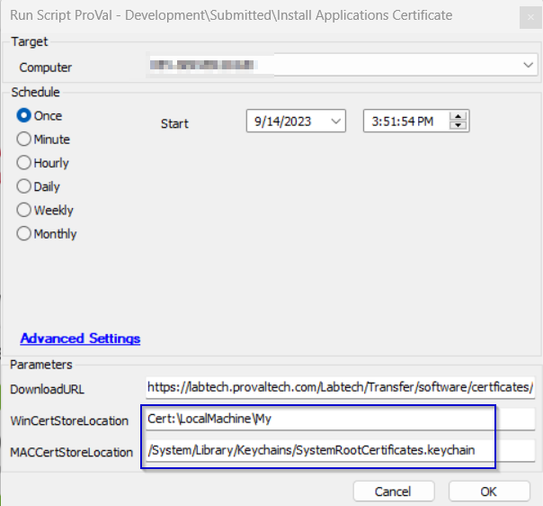

## Summary

This script installs the certificate to a defined certificate location on Windows/MAC machines. If no particular location is defined, it will import the certificate at the root location of the machine and will apply it to the entire system.

Provide the direct download URL for the Certificate in the User parameter and it will install the certificate.

## Sample Run

*Below is an example if you would like to add the certificate to My repository on a Windows machine and to the system's trusted root certificates keychain on MAC machines.*

## User Parameter

| Name                   | Required | Description                                                                                                                                                                                                                                   |
|------------------------|----------|-----------------------------------------------------------------------------------------------------------------------------------------------------------------------------------------------------------------------------------------------|
| DownloadURL            | True     | Direct download URL of the certificate *Something like this :*  <em>[https://labtech.provaltech.com/Labtech/Transfer/software/certficates/DNSFilter.cer](https://labtech.provaltech.com/Labtech/Transfer/software/certficates/DNSFilter.cer)</em> |
| WinCertStoreLocation   | False    | A particular certificate store on a Windows system to import the certificate. It could be something like `Cert://CurrentUser//Root`, `Cert://LocalMachine//My` etc.  If nothing is mentioned in the parameter, it will use the default store location i.e. `Cert://LocalMachine//Root` |
| MACCertStoreLocation   | False    | Particular keychain to import a certificate on a MAC Machine. It could be something like `/System/Library/Keychains/SystemRootCertificates.keychain`, `/Users/YourUsername/Library/Keychains/login.keychain` etc.  If nothing is mentioned in the parameter, it will use the default system-wide keychain and it applies trusted root certificates to the entire system i.e `/Library/Keychains/System.keychain` |

## Output

- Script log

*NOTE : This script will work for .crt, .cer, .cert extensions only*

*The download URL should be something like*  
*[https://labtech.provaltech.com/Labtech/Transfer/software/certficates/DNSFilter.cer](https://labtech.provaltech.com/Labtech/Transfer/software/certficates/DNSFilter.cer)*

