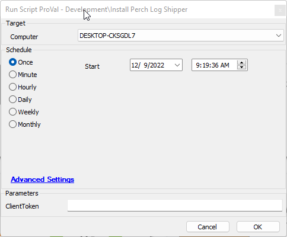
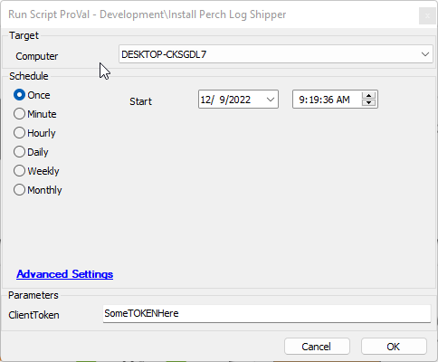
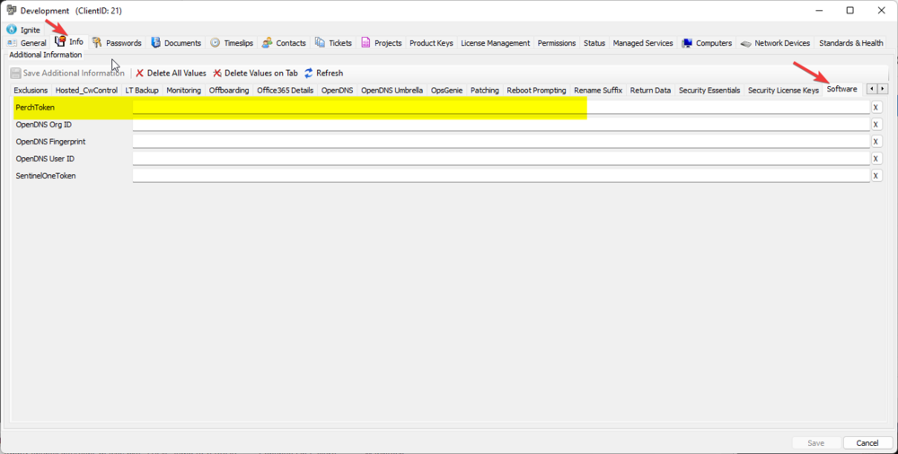
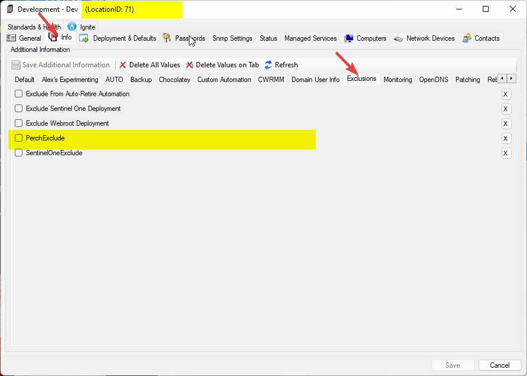
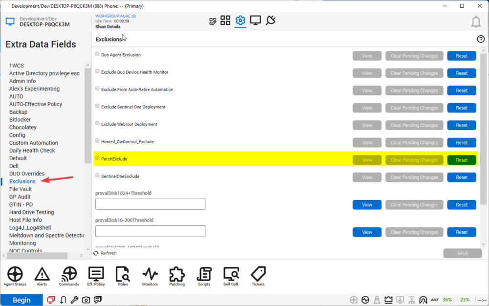

## Summary

This script will install Perch Log Shipper with either a user-provided ClientToken, or the token can be retrieved from a client-level EDF.

## Sample Run

- Executing the script without setting a ClientToken will result in the script obtaining the token from the client-level EDF.

- Executing the script with a ClientToken specified will utilize the ClientToken, bypassing any currently set client-level EDF.

## Dependencies

- [Perch Log Shipper Installer](https://cdn.perchsecurity.com/downloads/perch-log-shipper-latest.exe) must remain a valid download link.

## Implementation

Perch tokens are set in the following location:

Exclusions are set at the following locations:

## Variables

Document the various variables in the script. Delete any section that is not relevant to your script.

| Name            | Description                                                                                   |
|-----------------|-----------------------------------------------------------------------------------------------|
| PerchToken      | Variable used to hold the client-level EDF value set for the Perch installation.             |
| ComputerExclude | Variable used to determine if a computer-level exclusion is present for this installation.    |
| LocationExclude | Variable used to determine if a location-level exclusion is present for this installation.    |

#### User Parameters

| Name        | Example         | Required | Description                                        |
|-------------|------------------|----------|----------------------------------------------------|
| ClientToken | SomeTokenHere    | False    | The desired token to use for the Perch installation. |

## Process

1. Script Info Setup.
2. Validate the desired token.
   1. If a ClientToken is set, bypass and use that token.
   2. Get the PerchToken data from the client-level EDF.
3. Check for any computer or location exclusion; if one exists, exit with an error.
4. Check for the Perch Log Shipper application; if it exists, then exit with an error.
5. Download the installer.
6. Verify the install; if failed, exit with an error.
7. Run the installer.
8. Verify the installation; if it's not installed, exit with an error.

## Output

- Script log

