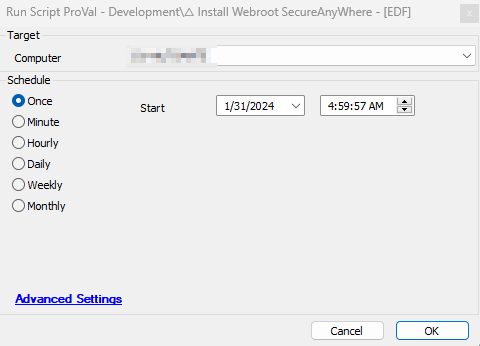

## Summary

This script deploys the Webroot to the agents using the "Webroot site keycode" client-EDF.

## Sample Run

## Dependencies

Please follow the below documents to get the Webroot Site Keycode and Webroot GroupName and GroupCode Fetching

- [Webroot Site KeyCode](https://proval.itglue.com/DOC-5078775-14989313)
- [Webroot GroupCode and GroupName Fetching](https://proval.itglue.com/DOC-5078775-14989323)

## EDFs

| Name                                      | Level  | Required | Description                                                                                                                                                                                                                                                                                 |
|-------------------------------------------|--------|----------|---------------------------------------------------------------------------------------------------------------------------------------------------------------------------------------------------------------------------------------------------------------------------------------------|
| Webroot Site KeyCode                      | Client | True     | This stores the site keycode which is available at the portal.                                                                                                                                                                                                                           |
| Webroot DisableUninstall                  | Client | False    | This sets the webroot uninstallation disabled during installation. It will prevent its uninstallation using the script or even the user can't uninstall it manually.                                                                                                                      |
| Exclude Webroot DisableUninstall          | Location | False   | If it is set to True then the agents of the location will be ignored for the disable uninstall set.                                                                                                                                                                                        |
| Exclude Webroot DisableUninstall          | Computer | False   | If it is set to True then the agent will be ignored for the disable uninstall set.                                                                                                                                                                                                         |
| WorkstationWebrootGroupName               | Client | False    | If the name is provided in the text EDF then it will be used for audit to show where the agent will move to a custom workstation group in the webroot portal sites. To get the group name follow the below document: [Webroot GroupCode and GroupName Fetching](https://proval.itglue.com/DOC-5078775-14989323). |
| WorkstationWebrootGroupCode               | Client | False    | This is the text EDF which needed to be filled with the Group code to direct the agent to move to it in the portal after installation. To get the group code follow the below document: [Webroot GroupCode and GroupName Fetching](https://proval.itglue.com/DOC-5078775-14989323). |
| ServerWebrootGroupName                    | Client | False    | This is the text EDF used for the servers to be filled with the group name to direct the agent to move to a server group after installation. To get the group name follow the below document: [Webroot GroupCode and GroupName Fetching](https://proval.itglue.com/DOC-5078775-14989323). |
| ServerWebrootGroupCode                    | Client | False    | This is the text EDF used for the servers to be filled with the group code to direct the agent to move to a server group after installation. To get the group code follow the below document: [Webroot GroupCode and GroupName Fetching](https://proval.itglue.com/DOC-5078775-14989323). |

## Output

- Script log

