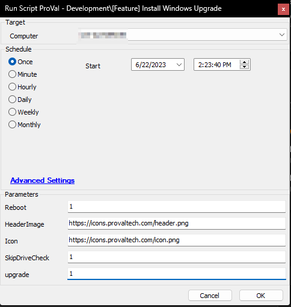
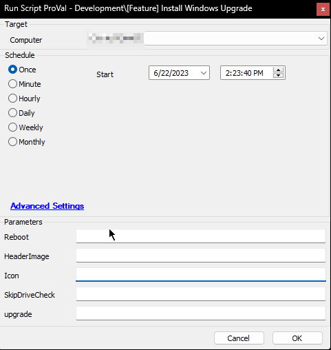
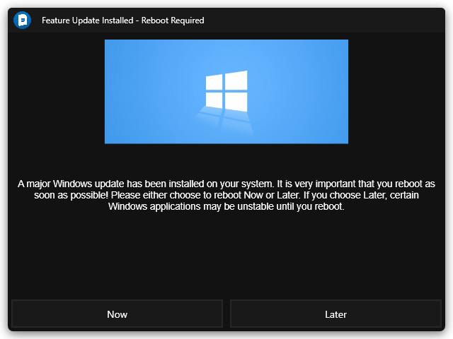

## Summary

Installs the latest feature update on a Windows 10+ machine and comes with an option to upgrade from Windows 10 to Windows 11. The script can either be executed from [ProVal - Production - Patching - Windows 10/11 Build Upgrades EOL Based](<../monitors/Windows 1011 Build Upgrades EOL Based.md>) monitor set or can be executed manually.

**Note:** Script can create a ticket for failures. If a ticket category is specified in the monitor set, the script will produce a ticket under that category by default. Otherwise, it will create a ticket under the default ticket category.

File Path: `C:/ProgramData/_automation/script/Install-FeatureUpdate/Install-FeatureUpdateAI.ps1`

**File Hash:**
- **SHA256:** `FDC149710B3ABB35D5F61218AB658C9C8881FAEB18CC223E0F1666D8E0120CF9`
- **MD5:** `172D4F2C1BD272FEC4CB8568423DEB30`

## Sample Run

To upgrade a computer from Windows 10 to Windows 11, forcefully reboot it, skipping Free Drive Space Check and with a custom image/icon in the user's prompt:  

To install the latest available feature pack on a Windows 10+ machine, without restarting and with the default image/icon in the user's prompt:  

### Example Prompt

## Dependencies

- [Install-FeatureUpdate](<../../powershell/Install-FeatureUpdate.md>)
- [Get SetupDiag Report](<./Get SetupDiag Report.md>)
- [CWM - Automate - Script - Prompter](<./Prompter.md>)
- [SEC - Windows Patching - Custom Table - plugin_proval_windows_os_support](<../tables/plugin_proval_windows_os_support.md>)
- [ProVal - Production - Patching - Windows 10/11 Build Upgrades EOL Based](<../monitors/Windows 1011 Build Upgrades EOL Based.md>)

#### User Parameters

| Name           | Example                                                        | Required | Description                                                                                                                                                                                                 |
|----------------|----------------------------------------------------------------|----------|-------------------------------------------------------------------------------------------------------------------------------------------------------------------------------------------------------------|
| Reboot         | 1                                                              | False    | If set to 1, will reboot upon successful installation without prompting any currently logged in user. Note: A reboot will be performed, ignoring this parameter, if no user is logged in. Set to 0 to disable. |
| HeaderImage    | [Header Image](https://icons.iconarchive.com/icons/martz90/circle-addon2/512/windows-update-icon.png) | False    | The header image to display in the user prompt. Defaults to: [Default Header Image](https://winaero.com/blog/wp-content/uploads/2015/05/Windows-10-banner-logo-nodevs-01.png)                         |
| Icon           | [Icon](https://icons.iconarchive.com/icons/martz90/circle-addon2/512/windows-update-icon.png)            | False    | The icon to use for the user prompt. Defaults to: [Default Icon](https://icons.iconarchive.com/icons/martz90/circle-addon2/512/windows-update-icon.png)                                                  |
| SkipDriveCheck | 1                                                              | False    | If set to 1, script will not check the free space available on the computer before performing the update/upgrade. Note: By default, script does not perform update/upgrade if free space is less than 20 GB. |
| upgrade        | 1                                                              | False    | If set to 1 for Windows 10 computers, script will attempt to upgrade the computer to Windows 11.                                                                                                       |

## Output

- Script Logs
- Tickets

## Ticketing

**Subject:**

- **For Windows Upgrade Failure:** `Windows Upgrade Failed for \<ClientName>/\<ComputerName>`
- **For Windows Feature Update Failure:** `Windows Feature Update Failed for \<ClientName>/\<ComputerName>`

**Body:**

**For any Security Application/AV blocking Script Execution:**  
`The windows upgrade script was unable to run on the computer because it was blocked by a security application or antivirus program. Please add the necessary exclusions to the program blocking it and re-run the script.`

**For Premature Termination of the script:**  
`The upgrade process appears to have been interrupted because it terminated after %sqlresult% minutes, which is not enough time for an upgrade to be installed. Please review the below logs to determine the root cause.`  
`Further information about troubleshooting Windows upgrade failures can be found here: [Troubleshooting Guide](https://learn.microsoft.com/en-us/windows/deployment/upgrade/resolve-windows-10-upgrade-errors)`  

Local Log Files  
----------------  
`\<Path of log file on Local Computer>`  
`\<Path of Error Log file on Local Computer>`

Information Log  
----------------  
`\<Information Logs>`

Error Log  
----------------  
`\<Error Logs if any>`

Script Output  
----------------  
`\<PowerShell Script Output>`

**For Pre-Reboot Installation Failure:**  
`The script encountered an error when installing the Feature Update. Please review the below logs to determine the root cause.`  
Further information about troubleshooting Windows upgrade failures can be found here: [Troubleshooting Guide](https://learn.microsoft.com/en-us/windows/deployment/upgrade/resolve-windows-10-upgrade-errors)

Local Log Files  
----------------  
`\<Path of log file on Local Computer>`  
`\<Path of Error Log file on Local Computer>`

Information Log  
----------------  
`\<Information Logs>`

Error Log  
----------------  
`\<Error Logs if any>`

Script Output  
----------------  
`\<PowerShell Script Output>`

**PowerShell Execution Failure:**  
`The script encountered an error when installing the Feature Update. Its not able to run the powershell on the machine: \<PowerShell Script Output>`

**If Reboot is suppressed and logged in user misses the reboot prompt:**  
`The active user on the machine has not responded to the reboot prompt after a successful Feature Update installation. Post-reboot log analysis will be skipped. If you would like to perform this analysis at a later time, please execute the "Get SetupDiag Report" script after the machine has rebooted.`

Local Log Files  
----------------  
`\<Path of log file on Local Computer>`  
`\<Path of Error Log file on Local Computer>`

**If Reboot is suppressed and user selects to reboot the computer later:**  
`The active user on the machine has chosen to forego rebooting after a successful Feature Update installation. Post-reboot log analysis will be skipped. If you would like to perform this analysis at a later time, please execute the "Get SetupDiag Report" script after the machine has rebooted.`

Local Log Files  
----------------  
`\<Path of log file on Local Computer>`  
`\<Path of Error Log file on Local Computer>`

**If computer fails to check back Automate post reboot:**  
`\<ScriptName> has attempted Feature Update on %computername% and has pushed a reboot on the machine after installing the updates but \<computername> has not come back online after 1 hour. Post-reboot analysis will be unavailable. Please run the "Get SetupDiag Report" script after check-in to perform post-reboot analysis.`

Local Log Files  
----------------  
`\<Path of log file on Local Computer>`  
`\<Path of Error Log file on Local Computer>`

**For Post Reboot Update/Upgrade Failures:**  
`The script detected a post-reboot failure from the Feature Update install. Please review the below logs to determine the root cause.`  
Further information about these issues can be found here: [Troubleshooting Guide](https://learn.microsoft.com/en-us/windows/deployment/upgrade/setupdiag#rules)

Local Log Files  
----------------  
`\<Path of log file on Local Computer>`  
`\<Path of Error Log file on Local Computer>`

Information Log  
----------------  
`\<Information Logs>`

Error Log  
----------------  
`\<Error Logs if any>`

Setup Diag Result  
----------------  
`\<Outcome of the SetupDiagTool verifying the upgrade process>`

