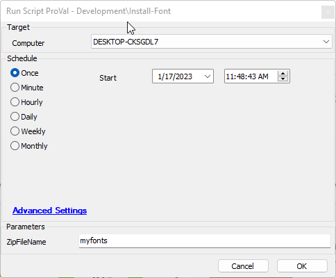

## Summary

This script is a wrapper to install fonts using the agnostic [SWM - Software Install - Agnostic - Script - Install-Font](https://proval.itglue.com/DOC-5078775-10371922).

## Sample Run

- As a first step please gather all desired font files and create a zip file containing those items.
- Place this file in the LTShare in the Transfer/FontFiles (Create this folder if necessary) Folder named [ZipFileName].zip.
- Import this script into the environment and run it against the desired targets.
- Set the ZipFileName = The zip file name you created minus the .zip.

## Dependencies

- [SWM - Software Install - Agnostic - Script - Install-Font](https://proval.itglue.com/DOC-5078775-10371922)

## Variables

Document the various variables in the script. Delete any section that is not relevant to your script.

| Name        | Description                             |
|-------------|-----------------------------------------|
| Fontocation | Designated as %windir%/Temp/Font      |

#### User Parameters

| Name        | Example                                        | Required | Description                                                 |
|-------------|------------------------------------------------|----------|-------------------------------------------------------------|
| ZipFileName | The name of the zip file stored in the LTShare | True     | This is the name of the .Zip file you created minus the .zip|

## Process

1. Download the font .zip file to the endpoint.
2. Extract the file.
3. Verify the file extracted.
4. Run the agnostic script.

## Output

- Script log

