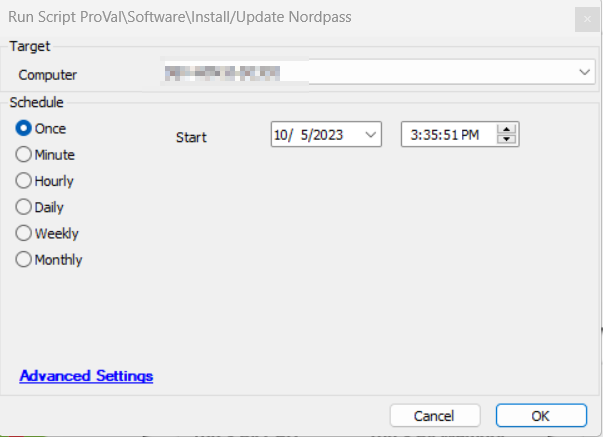

## Summary

This script installs or updates NordPass on the machines. The script will only install or update NordPass if a user is logged in. Otherwise, it will exit without performing the installation.

## Sample Run



## Global Parameters

| Name                     | Description                                                                                                                                                                           |
|--------------------------|---------------------------------------------------------------------------------------------------------------------------------------------------------------------------------------|
| TicketCreationCategory    | Set it to '0' to disable ticketing. Specify the TicketCreationCategory to direct the tickets to the appropriate board and enable ticket creation.                                  |
| TicketSubject            | Subject of the tickets                                                                                                                                                                 |

## Output

- Script Logs
- Tickets

## Ticketing

Tickets will be generated only if the TicketCreationCategory value is greater than 0 in the global parameters. Ensure that you use the correct TicketCreationCategory to direct the tickets to the appropriate board.

**Subject:** `SW - NordPass Installation Failed on %ComputerName% (%ComputerID%)`

**Ticket Body:** `Script failed to install NordPass on the machine %ComputerName%. Here are the installation attempt results: %shellresult%.`

The PC information is outlined below:  
PC Name: %computername%  
Last Login: %lastuser%  
PC Model: @biosname@  
OS: %os%  
S/N OF PC: @biosver@  

*Comment when the script fails to download the installer:*  
If the installation fails, you can try manually installing NordPass on your machine by following the instructions provided in the link below:  
[Installing NordPass on Windows](https://support.nordpass.com/hc/en-us/articles/360004799257-Installing-NordPass-on-Windows)  
This guide will walk you through the steps to install NordPass on your Windows system.

*When the script fails to download the installer:*  
`Failed to download NordPass Setup on the machine.`

The PC information is outlined below:  
PC Name: %computername%  
Last Login: %lastuser%  
PC Model: @biosname@  
OS: %os%  
S/N OF PC: @biosver@  

*Comment when the script fails to download the installer:*  
This issue often arises due to security software such as ThreatLocker or antivirus programs blocking the download. To resolve this, please ensure that you whitelist the following URLs in your ThreatLocker or antivirus settings:

```
https://downloads.npass.app/windows/NordPassSetup.exe  
https://downloads.npass.app/windows_x86/NordPassSetup_x86.exe
```

By whitelisting these URLs, you should be able to successfully download the NordPass Setup without any further issues.

*When the script fails to update NordPass:*  
`Script failed to update NordPass on the machine %ComputerName%. Here are the update attempt results: %shellresult%.`

The PC information is outlined below:  
PC Name: %computername%  
Last Login: %lastuser%  
PC Model: @biosname@  
OS: %os%  
S/N OF PC: @biosver@  

*Comment when the script fails to update NordPass:*  
If the update fails, you can try manually installing NordPass on your machine by following the instructions provided in the link below:  
[Installing NordPass on Windows](https://support.nordpass.com/hc/en-us/articles/360004799257-Installing-NordPass-on-Windows)  
This guide will walk you through the steps to install NordPass on your Windows system.


