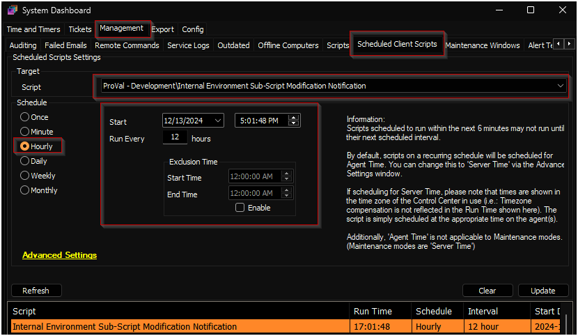
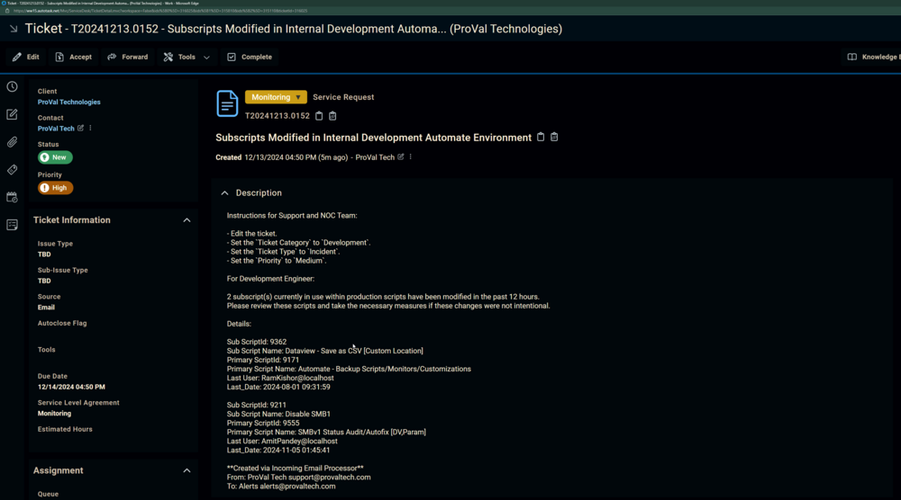
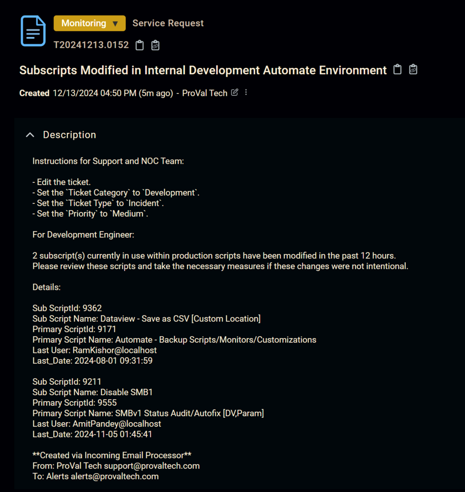

## Summary

This client script is exclusively built for our internal development environment. It creates a ticket in our Autotask portal with the data of the subscripts that have been modified in the last 12 hours.

**Note:** Do not import this script into other Automate environments.

## Sample Run

It is scheduled in our internal Automate environment to run twice per day.  

## Output

- Autotask ticket  

## Ticketing

**Subject:** `Subscripts Modified in Internal Development Automate Environment`

**Body:**  

`Instructions for Support and NOC Team:`

- Edit the ticket.  
- Set the `Ticket Category` to `Development`.  
- Set the `Ticket Type` to `Incident`.  
- Set the `Priority` to `Medium`.  

`For Development Engineer:`  

`@variableX@`  

**Sample Ticket:**  

