## Summary

The script generates a ticket containing information about internal monitors that have been disabled due to failure in the past `2` hours. It explicitly excludes monitor sets with the string `[Disabled]` in their names. This script is necessary because disabled monitors cannot independently create tickets about their status.

The script features an option to enable the disabled monitor sets, controlled by the system property `MonitorFailureCheck-EnableAutofix`. Setting this property to `1` activates the `Autofix` section of the script.

Within the Autofix section, there is an additional option to create a ticket if the script fails to enable the disabled monitor sets. This ticketing capability is governed by the system property `MonitorFailureCheck-AutofixFailureAlerting`. Setting this property to `1` enables the creation of `autofix` failure tickets.

The script can generate two types of Autofix failure tickets, each controlled by specific system properties:
1. **Immediate Autofix Failure Tickets:** The script generates a ticket if the total number of remaining disabled monitors (excluding intentionally disabled ones) exceeds the value stored in the system property `MonitorFailureCheck-MaxAllowedDisabledMonitors` after an autofix attempt.
2. **For Problematic Monitors:** The script creates a ticket for monitor sets that remain continuously disabled despite repeated Autofix attempts. Automate persists in disabling these monitors. This behavior is controlled by the system properties `MonitorFailureCheck-ThresholdDays` and `MonitorFailureCheck-ThresholdTimes`. The ticket contains information about monitor sets that have been disabled for more than the number stored in `MonitorFailureCheck-ThresholdTimes` within the past number of days stored in `MonitorFailureCheck-ThresholdDays`.

The ticket category for all tickets created by the monitor set can be defined in the `MonitorFailureCheck-TicketCategory` system property.

The `MonitorFailureCheck-EmailAlerts` property offers the option to enable email alerts in case of a failure.

## Update Notice: 14-Dec-2023

1. **New Script Introduction:** We have introduced a new script, `Internal Monitor - Failure Check [Autofix, Properties]`, to replace the previous script, `Internal Monitor - Failed [Tickets, Global]`.
   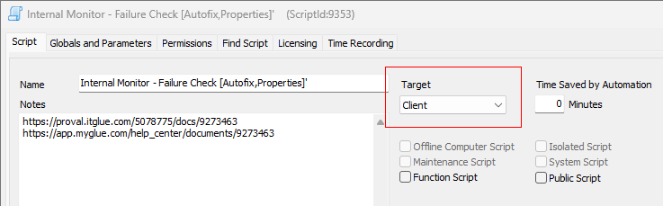
2. **Client Script Implementation:** The new script functions as a client script and is designed to generate client-level tickets.
3. **System Properties Usage:** In contrast to the prior script, the new version utilizes system properties instead of Global Variables. Specifically, the `MonitorFailureCheck-ClientIDForTicket` system property is employed to store the client ID for creating failure tickets.
   - **Default Behavior:** If `MonitorFailureCheck-ClientIDForTicket` is not configured, the script intelligently determines the client ID based on the following criteria:
     - For on-prem partners, the script uses the ClientID of the Automate Server.
     - For hosted partners, the script automatically selects the minimum ClientID containing a computer.
4. **Autofix Failure Tickets Enhancement:** Previously, the script only generated Autofix failure tickets for monitor sets continuously disabled despite Autofix attempts. We've introduced a new option in the script to create an instant ticket if Autofix fails to resolve the issue. The `MonitorFailureCheck-MaxAllowedDisabledMonitors` system property manages this behavior. If both `Autofix` and `Autofix Failure tickets` are enabled (by setting `MonitorFailureCheck-EnableAutofix` to `1` and `MonitorFailureCheck-AutofixFailureAlerting` to `1`), the script creates a ticket if the total number of remaining disabled monitors (excluding intentionally disabled ones) exceeds the value stored in `MonitorFailureCheck-MaxAllowedDisabledMonitors`.
5. **Action Required:** Users are encouraged to review and replace their scripts to incorporate these changes for optimal functionality.

## Implementation Steps

### For New Implementation:
1. **Importing the Script:**
   - Navigate to the ProSync Client Plugin.
   - Import the script following the established procedure.
2. **Create System Properties:** Execute the script against any client in the environment with the set environment parameter set to `1` to create the system properties used by the script.
   
   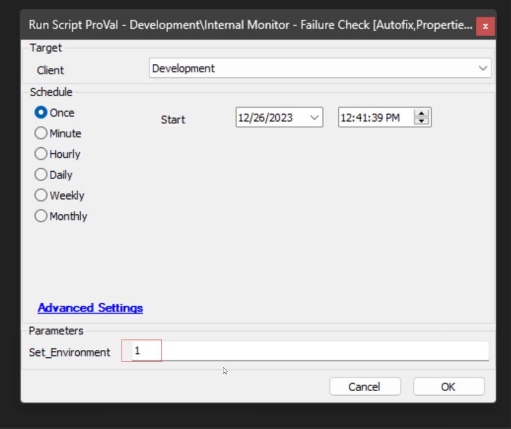
3. **System Properties Configuration (Initial Implementation):**
   - Refer to the **System Properties** section of the document for more information on the properties.
   - Ensure that the initial implementation includes the appropriate system properties as defined.
4. **Script Schedule:** Schedule the script following the example provided in the **Sample Run** section of the document.

### For Script Updates After 14-Dec-2023:
1. **Open the Script:**
   - Access the existing script (`Internal Monitor - Failed [Tickets, Global]`) in the environment where the update is required.
2. **Capture Current Global Variables:**
   - Before proceeding with the update, take a screenshot of the existing Global Variables settings to preserve the current configuration.
   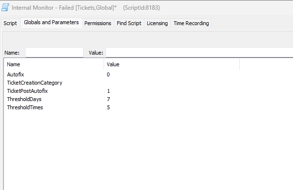
3. **Import the New Script:**
   - Navigate to the ProSync Client Plugin.
   - Import the new script (`Internal Monitor - Failure Check [Autofix, Properties]`) following the established procedure.
4. **Create System Properties:** Execute the script against any client in the environment with the set environment parameter set to `1` to create the system properties used by the script.
   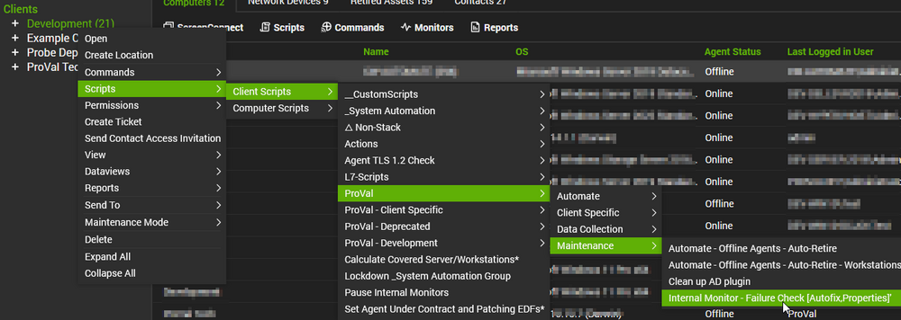
   
5. **System Properties Configuration (Initial Implementation):**
   - Refer to the **System Properties** section of the document for more information on the properties.
   - Verify that the values for the new system properties match those of the current Global parameters.
6. **Script Schedule:** Schedule the script following the example provided in the **Sample Run** section of the document.
7. **Remove the Old Script:** Delete the old script (`Internal Monitor - Failed [Tickets, Global]`) from the environment.

## Sample Run

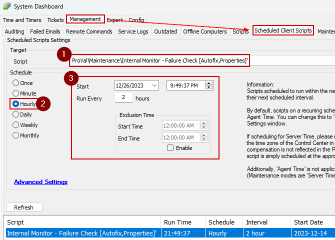

Consider scheduling the new client script to execute every two hours.

### System Properties

| Name | Former Global Variable | Default | Required | Description |
|------|------------------------|---------|----------|-------------|
| MonitorFailureCheck-EmailAlerts |  | 0 | False | Setting the value to `1` will activate the script's email feature. The script will then send an email to the address(es) stored in the default system property `_sysTicketDefaultEmail` after creating a ticket for any issues. 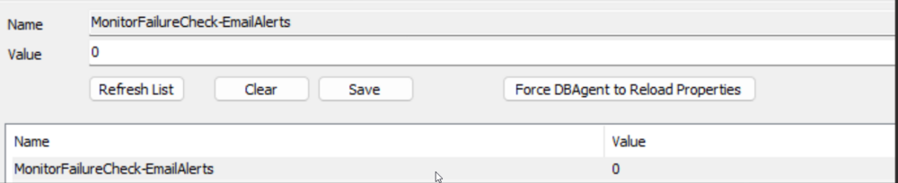  `_sysTicketDefaultEmail`: 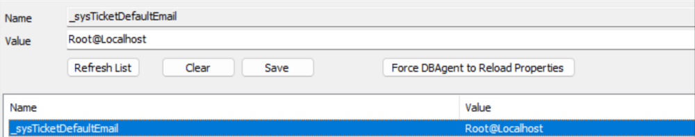 |
| MonitorFailureCheck-TicketCategory | TicketCreationCategory | 6 | False | Ticket category id of the ticket to be generated. Leave it blank to generate the ticket with the default script ticket category. 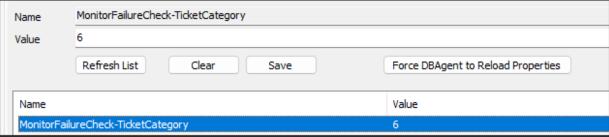  Default Script Ticket Category: 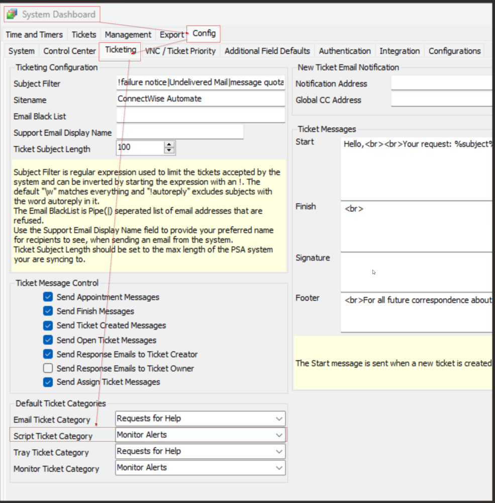 |
| MonitorFailureCheck-EnableAutofix | Autofix | 0 | True | If the value is set to `1`, it will trigger Autofix and disable the default detection ticketing. The default, set at `0`, generates a ticket for the disabled monitor set without attempting to enable them. 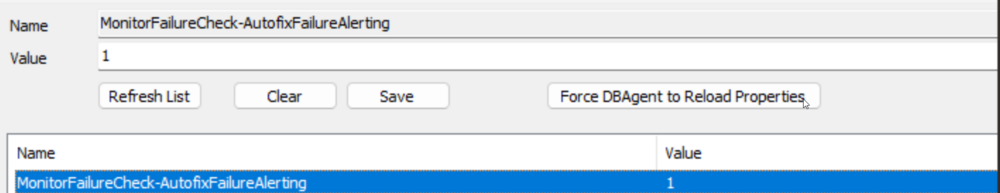 |
| MonitorFailureCheck-AutofixFailureAlerting | TicketPostAutofix | 1 | False | Setting the value to `1` will enable the Ticket generation feature after applying the Autofix. The script can create two types of Autofix failure tickets: one for the immediate failure of the Autofix and the other for monitor sets that are continuously getting disabled even after applying the Autofix multiple times. The behavior for these tickets can be controlled and managed by the system properties explained in the subsequent cells of this table. Note that `MonitorFailureCheck-EnableAutofix` must be enabled or set to `1` to use this property. 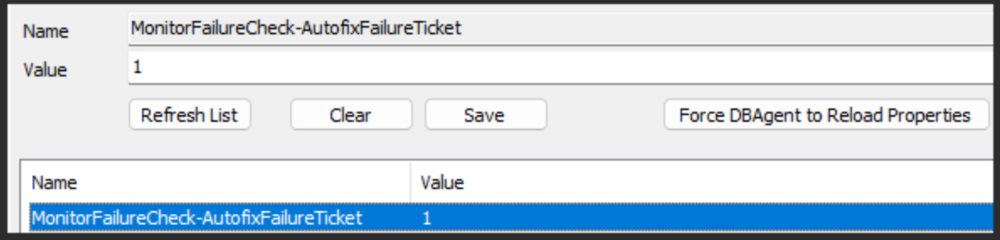 |
| MonitorFailureCheck-ThresholdDays | ThresholdDays | 7 | True | If the `MonitorFailureCheck-AutofixFailureAlerting` system property is set to `1`, the script checks for monitor sets that were disabled `X` number of times over `Y` number of days to identify those disabled multiple times. In this context, `Y` represents the number of days stored in the `MonitorFailureCheck-ThresholdDays` system property. `MonitorFailureCheck-EnableAutofix` and `MonitorFailureCheck-AutofixFailureAlerting` must both be set to `1` to utilize this property. 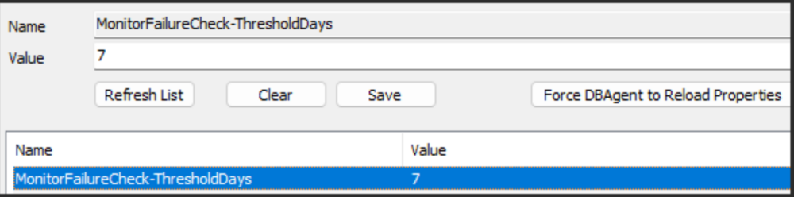 |
| MonitorFailureCheck-ThresholdTimes | ThresholdTimes | 5 | True | Stores the number of times (`X`) a monitor set must have failed over the past `Y` days, where `Y` is the number of days stored in the `MonitorFailureCheck-ThresholdDays` system property. To utilize this property, both `MonitorFailureCheck-EnableAutofix` and `MonitorFailureCheck-AutofixFailureAlerting` must be set to `1`. 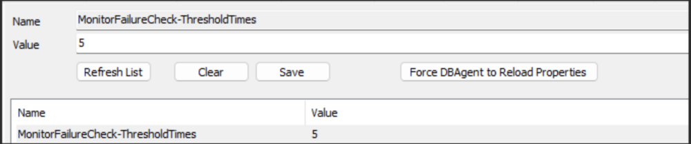 |
| MonitorFailureCheck-MaxAllowedDisabledMonitors |  | 5 | True | This property stores the number of disabled monitor sets that Automate fails to enable even after running the Autofix, serving as a basis for comparison before creating an Autofix failure ticket. To utilize this property, both `MonitorFailureCheck-EnableAutofix` and `MonitorFailureCheck-AutofixFailureAlerting` must be set to `1`. 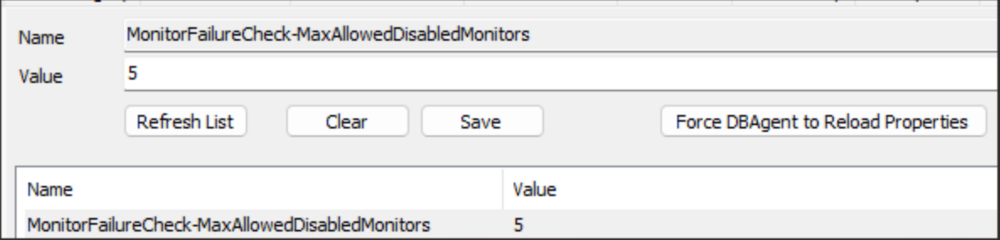 |
| MonitorFailureCheck-ClientIDForTicket |  | 0 | False | The ClientID for which failure tickets are intended to be created. This system property can be disregarded for on-prem partners and for hosted partners where the client ID of the internal environment is `1`. 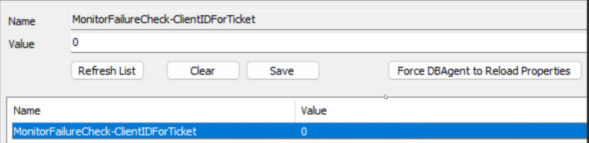 |

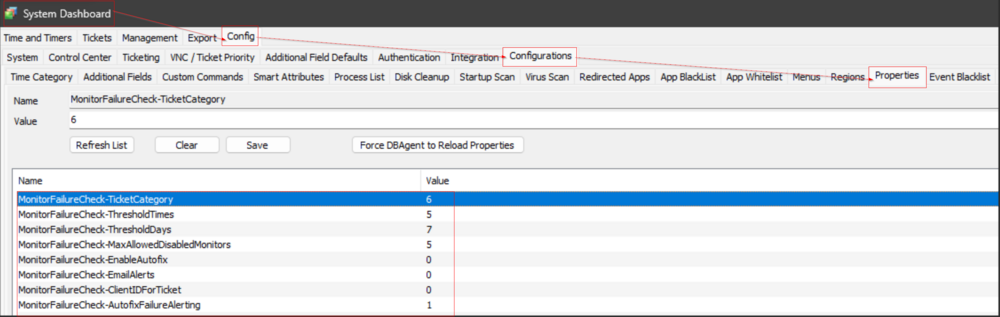

## Output

- Client-Level Ticket

## Sample Ticket

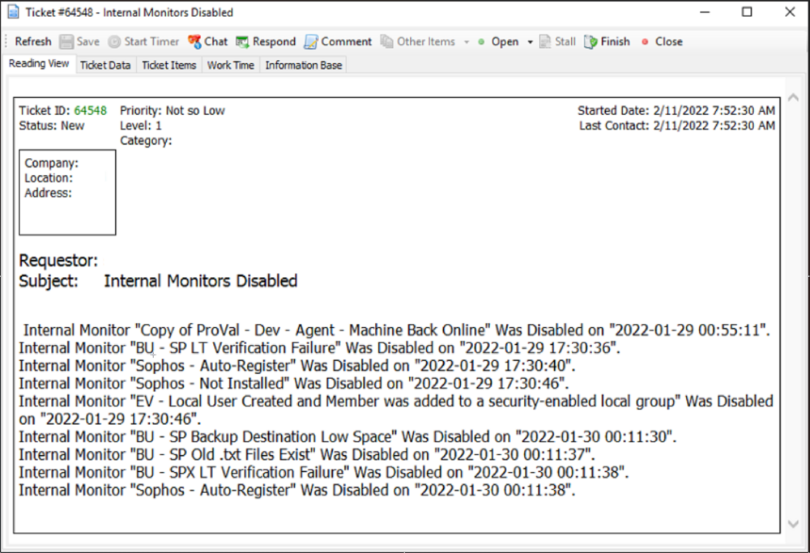
