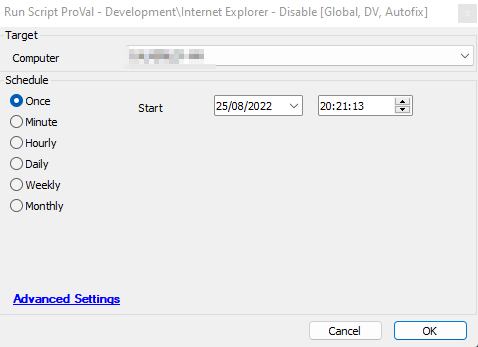
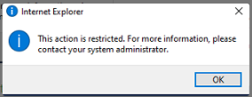

## Summary

This script disables Internet Explorer on a Windows machine.

## Sample Run

## Dependencies

[CWM - Automate - Internal Monitor - ProVal - Development - Internet Explorer Detected [Role]](<../monitors/Internet Explorer Detected Role.md>)

## Variables

| Name        | Description                                                         |
|-------------|---------------------------------------------------------------------|
| STATUS      | Status returned from the monitor set.                               |
| IEDisabled  | Outcome of the PowerShell script executing to disable Internet Explorer. |

#### Global Parameters

| Name        | Example     | Required | Description                                                                                      |
|-------------|-------------|----------|--------------------------------------------------------------------------------------------------|
| Reboot      | 0 or 1      | False    | 0 - Reboot Immediately; 1 - No Reboot                                                          |
| PromptUser  | 0, 1, or 2  | True     | 0 - Never Prompt; 1 - Always Prompt when user clicks IE (Default); 2 - Once per user prompt  |

## Process

1. Executes a PowerShell script to disable the Internet Explorer feature. The script sets the user prompt registry key so that the user receives a prompt after clicking/trying to access Internet Explorer. However, that prompt might never be needed as IE will be completely removed after reboot.
   
2. Verifies the outcome of the PowerShell script.
   
3. Marks the "IE Disabled" registry key.
   
4. If the PowerShell script returns an error or failure, the script will terminate with a log.
   
5. Upon success, it checks whether reboot is enabled or not within the global parameters. It will reboot the computer if the value of the Reboot parameter is set to 1. The default is 0.

## Output

- Script log
- EDF
- Dataview
