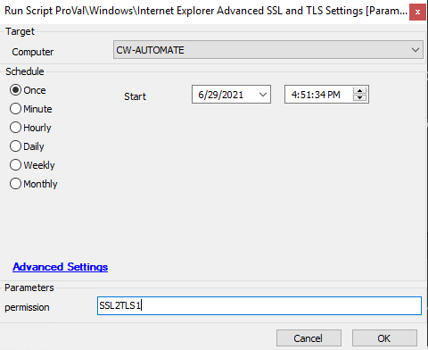

## Summary

This script will enable or disable SSL 2.0, SSL 3.0, TLS 1.0, TLS 1.1, and TLS 1.2 depending on the user's choice by providing input in the parameter.

**Time Saved by Automation:** 15 Minutes

## Sample Run

## Dependencies

[Internet Explorer Advanced SSL and TLS Settings [Script]](<../roles/Internet Explorer Advanced SSL and TLS Settings Script.md>)

## Variables

**Permission -- User Parameter**  
Various options are:

- permission = '0' THEN 'Use no secure protocols'
- permission = 'SSL2' THEN 'Only use SSL 2.0'
- permission = 'SSL3' THEN 'Only use SSL 3.0'
- permission = 'SSL23' THEN 'Use SSL 2.0 and SSL 3.0'
- permission = 'TLS0' THEN 'Only use TLS 1.0'
- permission = 'SSL2TLS0' THEN 'Use SSL 2.0 and TLS 1.0'
- permission = 'SSL3TLS0' THEN 'Use SSL 3.0 and TLS 1.0'
- permission = 'SSL23TLS0' THEN 'Use SSL 2.0, SSL 3.0, and TLS 1.0'
- permission = 'TLS1' THEN 'Only use TLS 1.1'
- permission = 'SSL2TLS1' THEN 'Use SSL 2.0 and TLS 1.1'
- permission = 'SSL3TLS1' THEN 'Use SSL 3.0 and TLS 1.1'
- permission = 'SSL23TLS1' THEN 'Use SSL 2.0, SSL 3.0, and TLS 1.1'
- permission = 'TLS01' THEN 'Use TLS 1.0 and TLS 1.1'
- permission = 'SSL2TLS01' THEN 'Use SSL 2.0, TLS 1.0, and TLS 1.1'
- permission = 'SSL3TLS01' THEN 'Use SSL 3.0, TLS 1.0, and TLS 1.1'
- permission = 'SSL23TLS01' THEN 'Use SSL 2.0, SSL 3.0, TLS 1.0, and TLS 1.1'
- permission = 'TLS2' THEN 'Only use TLS 1.2'
- permission = 'SSL2TLS2' THEN 'Use SSL 2.0 and TLS 1.2'
- permission = 'SSL3TLS2' THEN 'Use SSL 3.0 and TLS 1.2'
- permission = 'SSL23TLS2' THEN 'Use SSL 2.0, SSL 3.0, and TLS 1.2'
- permission = 'TLS02' THEN 'Use TLS 1.0 and TLS 1.2'
- permission = 'SSL2TLS02' THEN 'Use SSL 2.0, TLS 1.0, and TLS 1.2'
- permission = 'SSL3TLS02' THEN 'Use SSL 3.0, TLS 1.0, and TLS 1.2'
- permission = 'SSL23TLS02' THEN 'Use SSL 2.0, SSL 3.0, TLS 1.0, and TLS 1.2'
- permission = 'TLS12' THEN 'Use TLS 1.1 and TLS 1.2'
- permission = 'SSL2TLS12' THEN 'Use SSL 2.0, TLS 1.1, and TLS 1.2'
- permission = 'SSL3TLS12' THEN 'Use SSL 3.0, TLS 1.1, and TLS 1.2'
- permission = 'SSL23TLS12' THEN 'Use SSL 2.0, SSL 3.0, TLS 1.1, and TLS 1.2'
- permission = 'TLS012' THEN 'Use TLS 1.0, TLS 1.1, and TLS 1.2'
- permission = 'SSL2TLS012' THEN 'Use SSL 2.0, TLS 1.0, TLS 1.1, and TLS 1.2'
- permission = 'SSL3TLS012' THEN 'Use SSL 3.0, TLS 1.0, TLS 1.1, and TLS 1.2'
- permission = 'SSL23TLS012' THEN 'Use SSL 2.0, SSL 3.0, TLS 1.0, TLS 1.1, and TLS 1.2'
- ELSE permission = '' or provided any other value then status would be 'Not Detected'

#### User Parameters

| Name       | Example      | Required | Description                                                                 |
|------------|--------------|----------|-----------------------------------------------------------------------------|
| permission | SSL23TLS12   | True     | It will set IE Advanced setting to 'Use SSL 2.0, SSL 3.0, TLS 1.1, and TLS 1.2' |

#### Script States

| Name                    | Example                     | Description                                                               |
|-------------------------|-----------------------------|---------------------------------------------------------------------------|
| InternetExplorerSecurity | Store @permission@ Value    | This stores information of computer ID and value provided by the user where the script ran. |

## Process

- This script executes the PowerShell query to set the TLS and SSL settings. The PowerShell changes the machine-level registry settings for Internet Explorer.
- The logic of abbreviations is as follows: If you want to set SSL 2.0 and TLS 1.0, TLS 1.1 enabled, then you have the right as SSL2TLS01. SSL should be written first, followed by the number you want to enable; the same applies for TLS.
- The other value list is shown in the variables column.
- Write the permission value without quotes (i.e., permission = SSL2, SSL23, TLS1, SSL2TLS12, etc.).

## Output

- Script log
- Script state
- Data view
