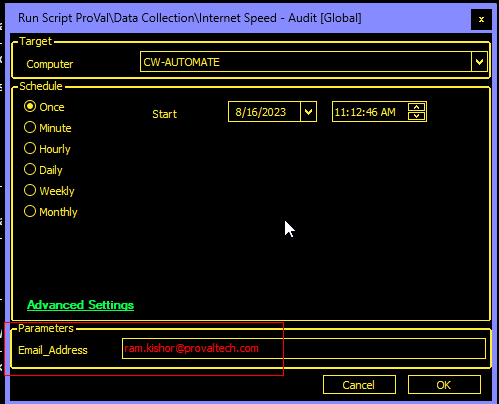
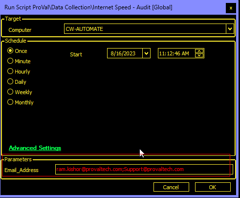
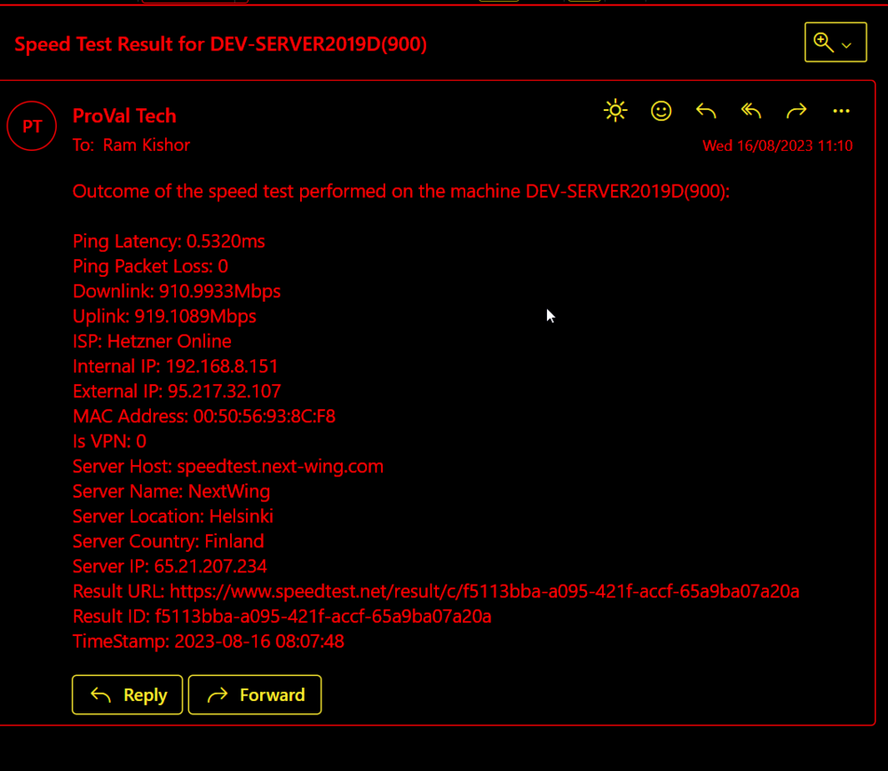

## Summary

Runs an internet speed test via the Ookla SpeedTest CLI application.

## Sample Run

Save the result to the database only.  
  
Save the result/output to the database and email it to [ram.kishor@provaltech.com](mailto:ram.kishor@provaltech.com)  
  
Save the result to the database and email it to both [ram.kishor@provaltech.com](mailto:ram.kishor@provaltech.com) and [support@provaltech.com](mailto:support@provaltech.com)  
  

## Dependencies

[EPM - Network - Agnostic - Test-InternetSpeed](https://proval.itglue.com/DOC-5078775-9099825)  

## User Parameter

| Name            | Example                                      | Required | Description                                                                                                                                                                |
|-----------------|----------------------------------------------|----------|----------------------------------------------------------------------------------------------------------------------------------------------------------------------------|
| Email_Address   | [support@provaltech.com](mailto:support@provaltech.com) | False    | Emails out the result to the provided email address(es). Multiple email addresses should be separated by a semi-colon (;). e.g., [ram.kishor@provaltech.com](mailto:ram.kishor@provaltech.com); [support@provaltech.com](mailto:support@provaltech.com) |

## Global Parameters

| Name                | Example | Required | Description                                                                                                           |
|---------------------|---------|----------|-----------------------------------------------------------------------------------------------------------------------|
| Retention            | 60      | True     | This sets the table data retention for each device; if the data is older than the retention value, it will be deleted. |
| Delete_Old_Data     | 1       | False    | If it is set to 1, then the deletion of data will work; else it will be skipped. By default, the value is set to 0 to skip. |

## Process

See [EPM - Network - Agnostic - Test-InternetSpeed](https://proval.itglue.com/DOC-5078775-9099825) for detailed information about the process. The script takes the output from this agnostic script and inserts it into a table: [EPM - Network - Custom Table - plugin_proval_speedtest_audit](https://proval.itglue.com/DOC-5078775-9166228).

## Output

- Script Log
- Local File
- Custom Table
- Dataview
- Email (if email address is provided in the user parameter)

## Sample Email

