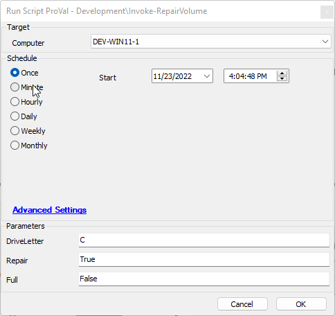
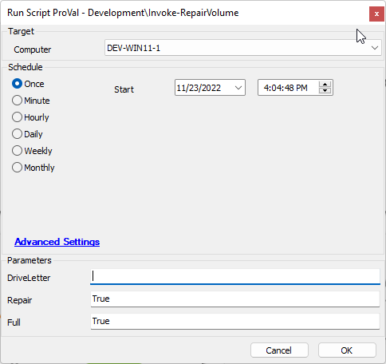

## Summary

Runs Windows volume repair against one or more volumes.

## Sample Run

  
Run a scan and repair on the C drive with minimal drive interruption.

  
Run a scan and repair on all available drives, stopping the drives completely during the process.

## Dependencies

- [EPM - Disk - Agnostic - Script - Invoke-RepairVolume](https://proval.itglue.com/DOC-5078775-11068928)

#### User Parameters

| Name        | Example                                                                                          | Required | Description                                        |
|-------------|--------------------------------------------------------------------------------------------------|----------|----------------------------------------------------|
| DriveLetter | - C- "C", "D"- Blank (Targets all available drives)                                     | False    | The target drives you wish to scan or repair      |
| Repair      | `True` Toggles on the repair of any found issues stopping the drive only when necessary`false` or ` ` ensures scanning only. | False    | Toggles Scan only to Scan and repair.             |
| Full        | `True` Toggles the -Repair option to be more intrusive stopping the drive for the entirety of the repair job.`False` or ` ` Ensures that Repair is set to the least intrusive method | False    | Toggles -Repair from least intrusive to most intrusive. |

## Process

1. Validates that the repair and Full parameters are within limits, if not errors and exits.
2. Review agnostic content document for process.

## Output

- Script log

