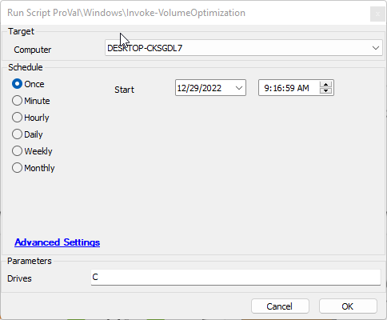
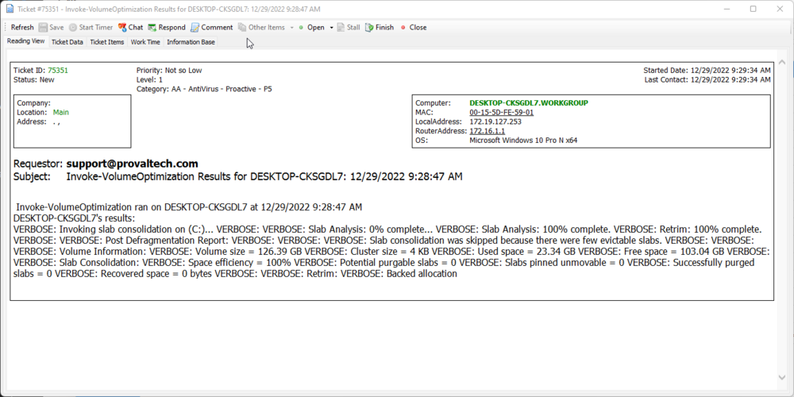

## Summary

This script runs the agnostic [EPM - Windows Configuration - Agnostic - Invoke-VolumeOptimization](https://proval.itglue.com/DOC-5078775-11110986).

## Sample Run

  
Will run a PowerShell equivalent of defrag on the target machine.

## Dependencies

- [EPM - Windows Configuration - Agnostic - Invoke-VolumeOptimization](https://proval.itglue.com/DOC-5078775-11110986)

## Variables

| Name          | Description                             |
|---------------|-----------------------------------------|
| TFail         | Used in ticketing on failure            |
| TSuccess      | Used in ticketing on success            |
| TicketSummary | The summary of any ticket created       |
| TicketBody    | The body of any created ticket.         |

### Global Parameters

| Name                    | Example | Required | Description                                                       |
|-------------------------|---------|----------|-------------------------------------------------------------------|
| TicketCreationCategory   | 167     | False    | The ticket creation category to be used with any created ticket.  |
| EnableTicketing         | Failure, Success, Failure, Success or empty | False | Failure will enable ticketing on failure; Success will enable ticketing on success; Failure, Success will enable ticketing on both; Blank will disable ticketing. |

### User Parameters

| Name    | Example | Required | Description                    |
|---------|---------|----------|--------------------------------|
| Drives  | C       | True     | The drives you wish to defrag  |

## Process

Please reference the agnostic document for process.

## Output

- Ticket (Please see section below)
- Script Log

## Ticketing

*Note to ProVal Team: Ticket subject lines should be short and simple. The body of the ticket should provide a detailed explanation of why a ticket was generated and, ideally, what the next steps should be when a user is looking at the ticket.*

If the script/monitor is intended to create tickets, please note the Subject and Body of the ticket below. Include an example ticket if possible.

**Subject**: %ScriptName% Results for %ComputerName%: %When%  

**Body**: %scriptname% ran on %computername% at %when%  
%computername%'s results:  
@psout@  

