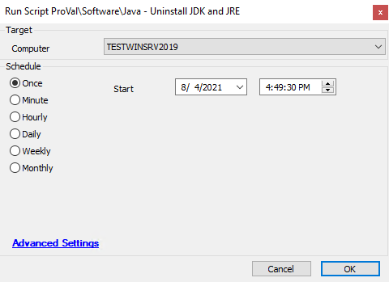

## Summary

This script will check and uninstall all installed versions of Java from the target machine. This script will create a RemoveJAVA.cmd file. Then run the .cmd file and it will uninstall Java from the machine.

Time Saved by Automation: 5 Minutes

## Sample Run

## Dependencies

- Windows OS
- @Java Removal Procedure (Agnostic content)

## Variables

- @SoftwareCnt@ -> How many versions of Java are installed

## Process

1. The script verifies that Java is detected installed
2. Counts how many versions of Java are installed on the machine
3. Write up the required uninstall RemoveJAVA.cmd file and runs it
4. The script loops through each detected Java install
5. The script will verify that all versions of Java are removed
   - Logs a failure in Automate's script logs if there's Java still detected

## Output

- Script log

