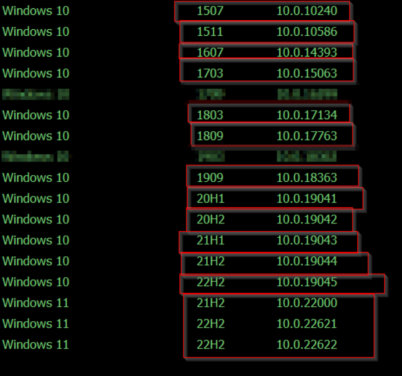
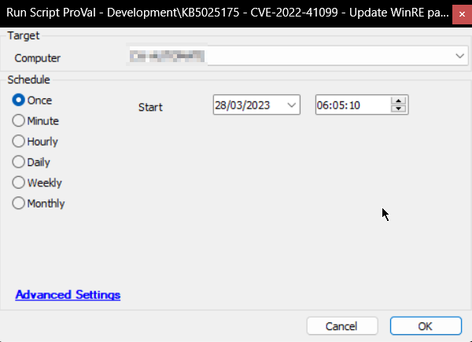

## Summary

Microsoft has fixed a vulnerability in the Windows Recovery Environment (WinRE) for Windows 10 and 11 systems that could allow access to encrypted data on storage devices. This script updates the WinRE (Windows Recovery Environment) images to protect Windows devices from a BitLocker security bypass vulnerability tracked as [CVE-2022-41099](https://msrc.microsoft.com/update-guide/vulnerability/CVE-2022-41099).

OS-version-specific and processor architecture-specific [Safe OS Dynamic update package](https://www.catalog.update.microsoft.com/Search.aspx?q=Safe%20OS) has not been released by Microsoft for all versions of Windows 10 and 11. Hence, a few versions of Windows 10 and 11 are not supported by the script.

**Supported OS:**  

**References:**  
- [The Register Article](https://www.theregister.com/2023/03/19/microsoft_fix_bitlocker_bypass/)  
- [Microsoft Support Article](https://support.microsoft.com/en-us/topic/kb5025175-updating-the-winre-partition-on-deployed-devices-to-address-security-vulnerabilities-in-cve-2022-41099-ba6621fa-5a9f-48f1-9ca3-e13eb56fb589)  
- [Safe OS Dynamic Update Package](https://www.catalog.update.microsoft.com/Search.aspx?q=Safe%20OS)  

## Sample Run

  
*The script can be scheduled to run on a group of supported Windows 10 and 11 machines.*

## Variables

| Name               | Description                                                               |
|--------------------|---------------------------------------------------------------------------|
| EDF                | Value of `WinRE Patch Applied` EDF                                       |
| ProjectName        | PatchWinRE                                                               |
| WorkingDirectory    | C:/ProgramData/_automation/script/PatchWinRE                            |
| Label              | Label to jump, based on the OS version                                   |
| DownloadURL        | Download URL of Safe OS Dynamic Patch for the concerned OS Version       |
| Psout              | Output returned by the PowerShell Script                                  |
| finishstatus       | Result returned by the [CWM - Automate - Script - PowerShell Response - All Errors - Check](<./PowerShell Response - All Errors - Check.md>) script |

#### EDF

| Name                  | Type      | Required | Description                                                                 |
|-----------------------|-----------|----------|-----------------------------------------------------------------------------|
| WinRE Patch Applied    | CheckBox  | True     | Script marks the check box for successful execution. It also verifies the EDF at the beginning to avoid multiple executions. |

## Output

- Script Logs
- EDF
- Dataview

