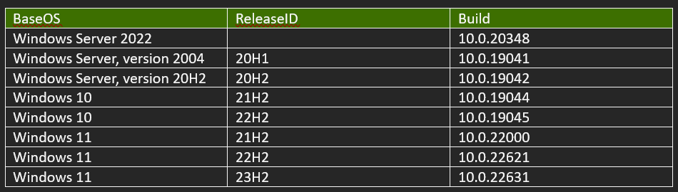
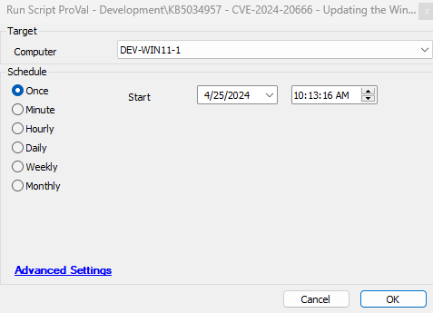

## Summary

This script automates the updating of WinRE images on supported Windows OS. It updates the WinRE partition on deployed devices to address security vulnerabilities in CVE-2024-20666.

Refer to article:  
[https://support.microsoft.com/en-us/topic/kb5034957-updating-the-winre-partition-on-deployed-devices-to-address-security-vulnerabilities-in-cve-2024-20666-0190331b-1ca3-42d8-8a55-7fc406910c10](https://support.microsoft.com/en-us/topic/kb5034957-updating-the-winre-partition-on-deployed-devices-to-address-security-vulnerabilities-in-cve-2024-20666-0190331b-1ca3-42d8-8a55-7fc406910c10)

Supported OS:

## Sample Run

## Dependencies

[SWM - Agnostic - KB5034957 - CVE-2024-20666 - Updating the WinRE partition](https://proval.itglue.com/DOC-5078775-15721389)

#### Global Parameters

| Name               | Default | Required | Description                                                                                                           |
|--------------------|---------|----------|-----------------------------------------------------------------------------------------------------------------------|
| EnableTicketing    | 1       | False    | 1/0 to toggle between ticket creation for failures while being used as an autofix.                                   |
| FailureEmail       | 0       | False    | 1/0 to Opt-In/Opt-Out Emails for failures while being used as an autofix.                                          |
| SuccessEmail       | 0       | False    | 1 to receive the success emails as well, and 0 to ignore. Only usable when FailureEmail is set to 1.                |
| EmailAddresses     |         | True     | (Only if FailureEmail = 1) Email Address(es) to Email the failures. Multiple emails must be separated by a semicolon. e.g., [abc@def.com](mailto:abc@def.com); [ghi@jkl.com](http://;ghi@jkl.com); [mno@pqr.com](http://;mno@pqr.com) |

## EDF

| Name                               | Level      | Type  | Required | Description                                                                                          |
|------------------------------------|------------|-------|----------|------------------------------------------------------------------------------------------------------|
| Update WinRE Partition KB5034957   | Computer   | Text  | True     | It stores the Updated result once the script results successfully on the computer                   |

## Process

Import the script.  
Execute the script.  
With the device started up into the running version of Windows installed on the device, the script will perform the following steps:

1. Mount the existing WinRE image (WINRE.WIM).
2. Update the WinRE image with the specified Safe OS Dynamic Update (Compatibility Update) package available from the [Windows Update Catalog](https://www.catalog.update.microsoft.com/Search.aspx?q=Safe%20OS). We recommend that you use the latest Safe OS Dynamic Update available for the version of Windows installed on the device.
3. Unmount the WinRE image.
4. If the BitLocker TPM protector is present, reconfigure WinRE for BitLocker service.

## Output

- Script Log
- Dataview

