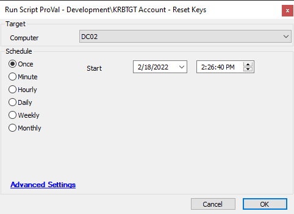

## Summary

Script used to reset the KRBTGT Active Directory account. Adapted from [https://github.com/microsoft/New-KrbtgtKeys.ps1/blob/master/New-KrbtgtKeys.ps1](https://github.com/microsoft/New-KrbtgtKeys.ps1/blob/master/New-KrbtgtKeys.ps1)

This script is provided "without warranty". 

It is in essence a streamlined version of the adapted script to always run the live account reset with some modernization of the PowerShell mixed in. 

Due to this, results are not guaranteed, and if at all possible should always be run manually and logins should be immediately tested. 

*YOU HAVE BEEN WARNED*

## Sample Run

## Dependencies

- [RSM - Active Directory - Agnostic - Reset-KrbtgtKeys](https://proval.itglue.com/DOC-5078775-9324848)

## Process

See [RSM - Active Directory - Agnostic - Reset-KrbtgtKeys](https://proval.itglue.com/DOC-5078775-9324848) for process details.

## Output

- Script log
- Local file on computer

