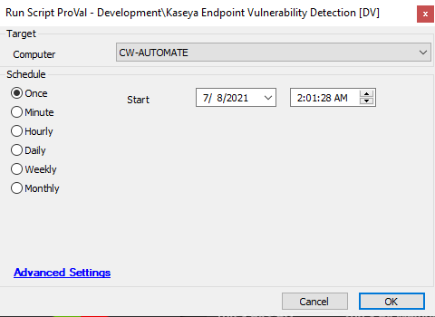

## Summary

This script will check for Kaseya endpoints where the endpoint has been exposed or is vulnerable to the REvil attack.

Time Saved by Automation: 10 Minutes

## Sample Run

## Dependencies

[Kaseya Vulnerability Audit](https://proval.itglue.com/DOC-5078775-7836236)

#### Script States

| Name                     | Example                   | Description                                                                                     |
|--------------------------|---------------------------|-------------------------------------------------------------------------------------------------|
| VSAEndpointDetection      | Safe -- %shellresult%     | This will store the powershell output and using comparator it will say whether the machine is safe or vulnerable. |

## Process

- This script will run a powershell on machines to check the suspicious certificate, suspicious executable, suspicious encryption and lastly whether vulnerable or not.
- It is log complete result and status whether agent is vulnerable or safe.

## Output

- Script log
- Script state
- Dataview

