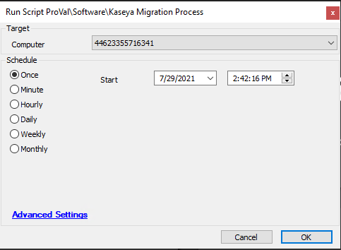

## Summary

Script used to migrate an Automate agent to the respective Kaseya Group ID. This should be used for migrations from CWA to Kaseya.  
Note that this requires configuration outside of Automate in Kaseya and Bitbucket, so please review with an escalation point if you do not have access.

Time Saved by Automation: 10 Minutes

## Sample Run

Target: Windows Agent  

## Dependencies

A generic installer file for the target Kaseya instance uploaded to Bitbucket and copied to the LTShare in the /Transfer/Software directory.  
Note: Lines 6 and 8 are disabled to remind you to do this before implementing.  
All Group IDs must be created in Kaseya before running the script.  
`@vsa-clientname.exe`

## Variables

`@concatArg@` - This variable is used to generate a Kaseya style container name to ensure fields will map between both environments. Example: ProValTech.LocationName

## Process

The script will attempt to download the agent installer from the ProVal repository, and if the download fails, it will attempt to download from the Automate server LTShare. The `@vsa-Clientname.exe` performs most of the task. Please review the exe document for more details on the process.

## Output

Outputs fail/success to the script log in Automate.

