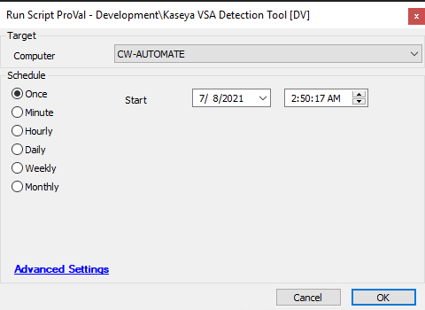

## Summary

This script performs a vulnerability scan on the VSA server and logs the output to a dependent dataview.

**Time Saved by Automation:** 10 Minutes

## Sample Run

## Dependencies

[Kaseya Vulnerability Audit](<../dataviews/Kaseya Vulnerability Audit.md>)

### Script States

| Name                     | Example               | Description                                                                                       |
|--------------------------|-----------------------|---------------------------------------------------------------------------------------------------|
| VSAEndpointDetection      | safe -- %shellresult% | This will store the script output and comparative status indicating whether the server is vulnerable or safe.   |

## Process

- This script will detect suspicious certificate checks, suspicious executable checks, suspicious file reference checks, scan for intrusion risks, and malicious file checks, reporting everything to the dataview.
- This should be targeted to the VSA server only.

## Output

- Script log
- Script state
- Dataview
