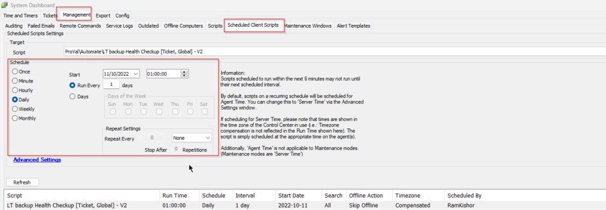

## Summary

This script detects the health of LT Backups in the client environment and alerts users if the last backup update (UTC) is older than 2 days or if the last backup size is smaller than 99 MB. It also has the option to send a ticket to Proval.

## Sample Run

**Schedule it to run once per day.**  
**Remove "Nightly Database Backup Monitoring [Global]" script from the schedule as we don't want two emails for the same issue.**

## Variables

Document the various variables in the script. Delete any section that is not relevant to your script.

| Name              | Description                                                                                     |
|-------------------|-------------------------------------------------------------------------------------------------|
| LTOldBackup       | Stores 1 or 0 based on whether a backup older than 2 days is detected.                        |
| LTBackupSizeIssue | Stores 1 or 0 based on whether the last backup size is smaller than 99 MB.                    |

#### Global Parameters

| Name           | Example | Required | Description                                                                                   |
|----------------|---------|----------|-----------------------------------------------------------------------------------------------|
| TicketCreation  | 1 or 0 | False    | 1 - Send Email to [Alerts@provaltech.com](mailto:Alerts@provaltech.com); 0 - No Email. Default: 1 |

#### Script States

| Name             | Example  | Description                                                                                      |
|------------------|----------|--------------------------------------------------------------------------------------------------|
| LTBackupChecker   | 825567   | Stores the ticket ID for future ticket commenting to reduce ticket noise.                       |

## Process

This script detects whether the LT backup ran successfully by checking the backup's last execution date (not older than 2 days) and the current file size (not smaller than 99 MB). If any of these conditions are met, it will send an email to [Alerts@provaltech.com](mailto:Alerts@provaltech.com) to create a high-priority ticket in our AutoTask.

## Output

- Script log
- Email
