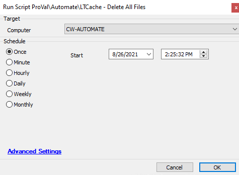

## Summary

This script will clean up the LT caching folder.

Time Saved by Automation: 10 Minutes

## Sample Run

## Variables

| Variable        | Description                                                                                      |
|------------------|--------------------------------------------------------------------------------------------------|
| CacheServerName  | This stores the SCDrive tweak name where //// replaced with blank after first //.              |

## Process

- Script will get the configured cache folder on the Location level.
- Then it will look for the machines where the LT cache was created.
- Script will check on the machine if the Cache folder exists. If it does, then it will remove all the items from the caching folder.

## Output

- Script log

