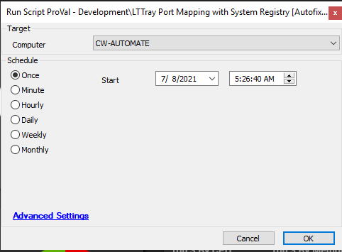

## Summary

This script maps the port number from netstat and the Windows registry of the LTTray, resolving the intermittent issue of LTTray not showing.

**Time Saved by Automation:** 10 Minutes

## Sample Run

## Dependencies

[LTTray Detection](/docs/28ddee2c-510a-4557-941a-168d155eacdc)

#### Global Parameters

| Name               | Example | Required | Description                                                                 |
|--------------------|---------|----------|-----------------------------------------------------------------------------|
| Ticket Creation     | 0       | False    | 0 -- No ticket; 1 -- Script will create a ticket for failed attempts       |

#### Script States

| Name              | Example    | Description                                                        |
|-------------------|------------|--------------------------------------------------------------------|
| LTTrayAutofix     | %ticketid% | This script state will store the LTTray ticket record for auto-close and commenting |

## Process

- This script checks for the `ltsvc` process.
- Once found, it checks the port information in netstat.
- It then matches the port value with the registry value.
- If the port value is mismatched, it replaces the registry value with the netstat value.
- After resetting, it checks again to confirm if the value is set properly.
- If there is an issue during resetting, it creates a ticket.

## Output

- Script log
- Script state

