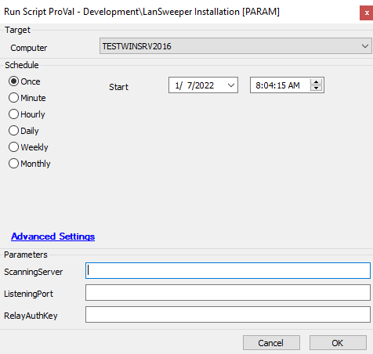
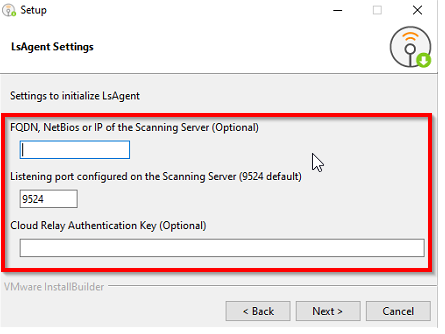

## Summary

Installs the LanSweeper agent.  
[https://www.lansweeper.com/download/lsagent/](https://www.lansweeper.com/download/lsagent/)

## Sample Run

## Dependencies

[https://www.lansweeper.com/download/lsagent/](https://www.lansweeper.com/download/lsagent/)

#### User Parameters

| Name            | Example                     | Required | Description                                           |
|-----------------|-----------------------------|----------|-------------------------------------------------------|
| ScanningServer   | FQDN, NetBIOS or IP        | False    | The FQDN, Netbios or IP of the scanning server       |
| ListeningPort    | 9524                        | False    | Listening port configured of the scanning server      |
| RelayAuthKey     | Key                         | False    | Cloud Relay Authentication Key                         |

## Process

[https://www.lansweeper.com/knowledgebase/silently-installing-lsagent-on-a-windows-linux-or-mac-computer/](https://www.lansweeper.com/knowledgebase/silently-installing-lsagent-on-a-windows-linux-or-mac-computer/)  
It is dependent on three parameters for installation to complete, they are:  
  

Once the value provided during script execution, the LsAgent will be successfully installed.

## Output

- Script log

