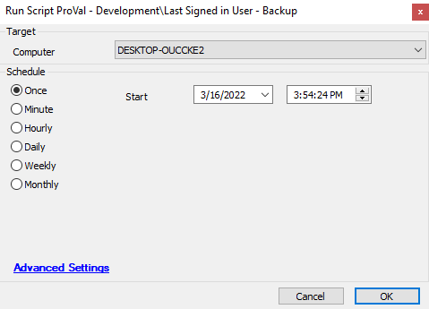

## Summary

This script is used to store the last signed-in user so PRONOC users can run this script prior to logging in, and then can put the computer back into the state it was in prior to logging in after work is completed.

## Sample Run

## Variables

| Name          | Description                                                                                       |
|---------------|---------------------------------------------------------------------------------------------------|
| LogonBackup   | Collects information about backup taken successfully or not. The reg backup at path: C:/Temp/Logonbackup/logonexport.reg |

## Process

This script stores the last sign-in user info from the registry as a registry backup to the local computer. It stores the last logged in user data to the file "C:/Temp/Logonbackup/logonexport.reg". It then queries the results of the returned script for errors and sends this to the script log.

## Output

- Script log

