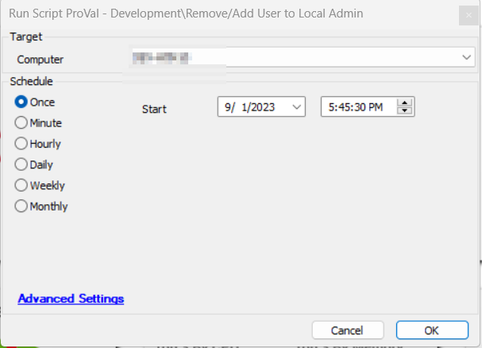
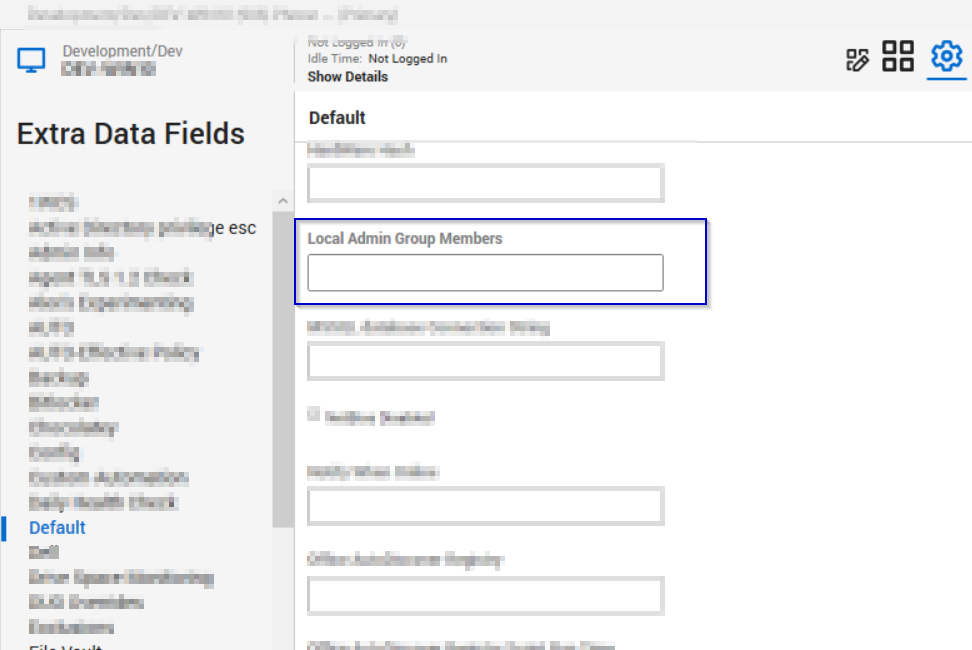
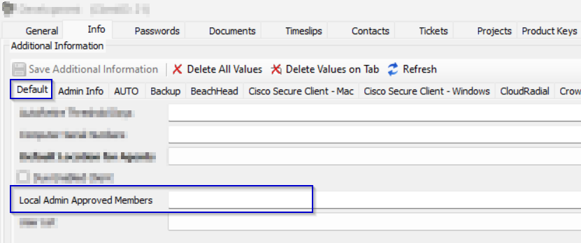

## Summary

This script will remove users other than approved members from the Local Admin group. It will also add any missing approved members to the Local Admins group. The script will exit if run against a Domain Controller; otherwise, it will execute its normal functionality.

## Script Target

Windows OS other than Domain Controllers

## Sample Run

## Global Parameters

| Name                     | Example                                                                                     | Required | Description                                                                                                                          |
|--------------------------|---------------------------------------------------------------------------------------------|----------|--------------------------------------------------------------------------------------------------------------------------------------|
| TicketCreationCategory    | 293                                                                                         | True     | Specify the ticket creation category in order to enable ticketing on the machine. Use '0' to disable ticketing.                     |
| TicketSubject            | Failed to add or remove the users from the Local Admin group for %ClientName% on %ComputerName% (%ComputerID%) | True     | The subject of the tickets that will be generated from the script                                                                     |

## System Properties

| Name                          | Description                                                                                                                                                                                                                         |
|-------------------------------|-------------------------------------------------------------------------------------------------------------------------------------------------------------------------------------------------------------------------------------|
| Local_Admin_Group_Approved_Members | The default users/groups to be approved globally in the Local Admins Group. If it does not already exist, the script will create the system property, and its default value will be `'Administrator', 'Domain Admins'`. |

## Variables

| Variable Name      | Description                                       |
|--------------------|---------------------------------------------------|
| Approved_Members   | Users/Groups allowed in the Local Admin Group     |
| ScriptOutput       | The output of the PowerShell run on the machine    |

## Dependencies

Agent EDF to remove/add user/group to the local admin specifically for that machine

Client Level EDF to remove/add user/group to the local admin specifically for a particular client

If nothing is mentioned in the Agent and Client EDF, the default users/groups mentioned in the system property `"Local_Admin_Group_Approved_Members"` will be used.

## Output

- Script log
- Tickets

## Ticketing

To enable ticketing on failure, the ticket category must be set in the global parameters of the script. The `TicketCreationCategory` parameter should not be equal to '0'.

**Ticket Subject:** `SEC - Failed Local Admin Group Cleanup on %ComputerName%`

**Ticket Body:**  
`We attempted to ensure that the approved users/groups (@Approved_Members@) were added to the Local Admin group and all others were removed; however, we encountered the following errors:`

`Results of the script attempt to add the approved users to the Local Admin group:`  
`Failed to add user1`  
`Failed to add user2`  

`Results of the script attempt to remove all user accounts from the Local Admin group other than approved members:`  
`Failed to remove user1`  
`Failed to remove user2`  

`Please look into why this automation failed to complete.`  
`Thank you`

