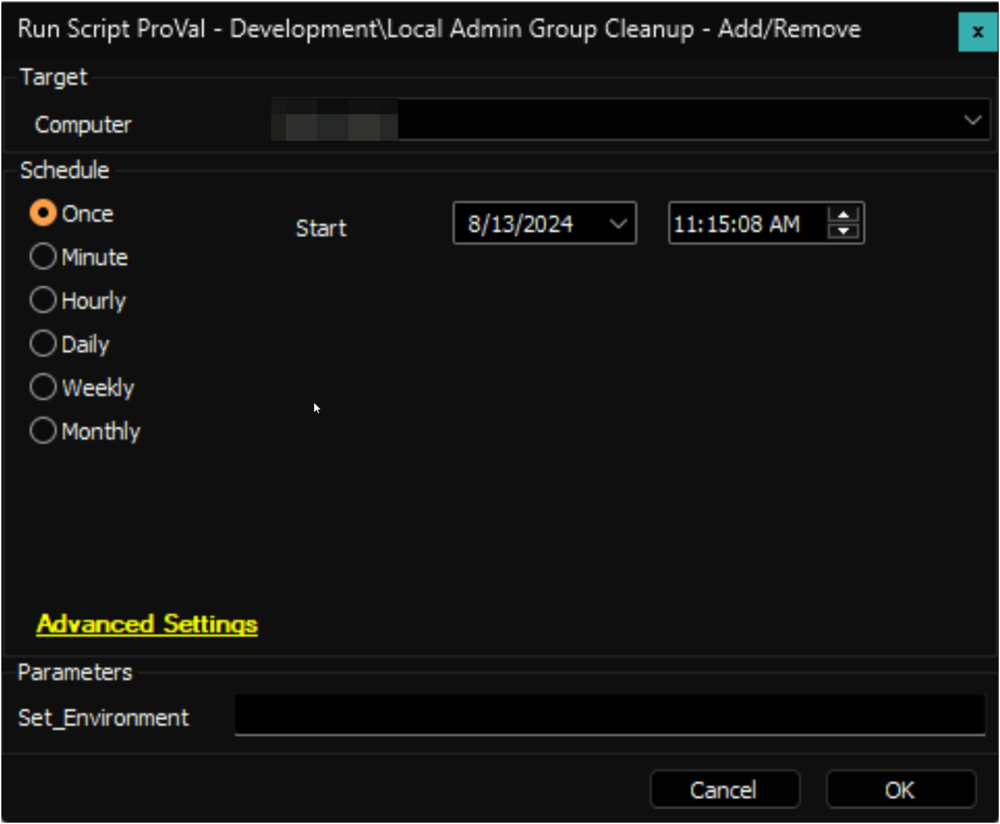
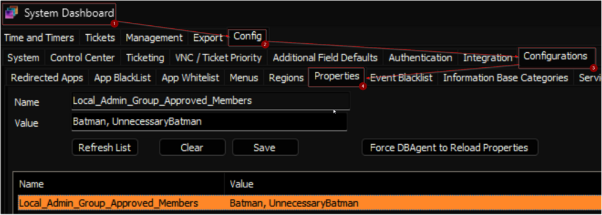
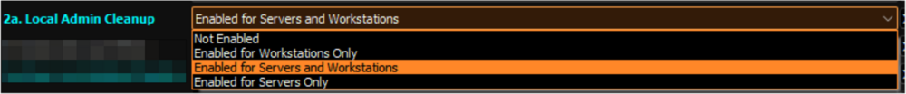
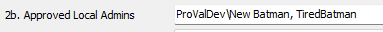
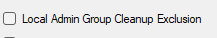
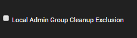
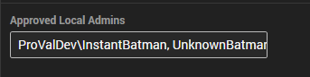
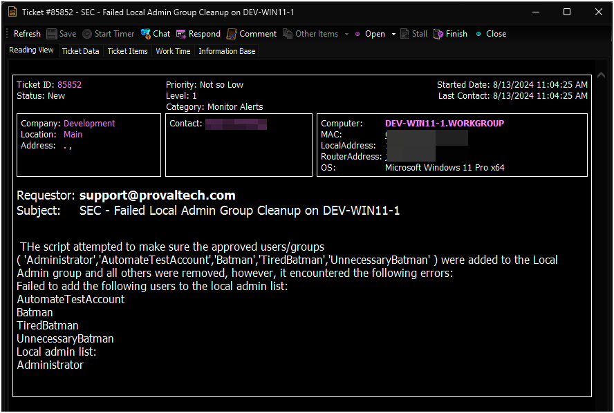
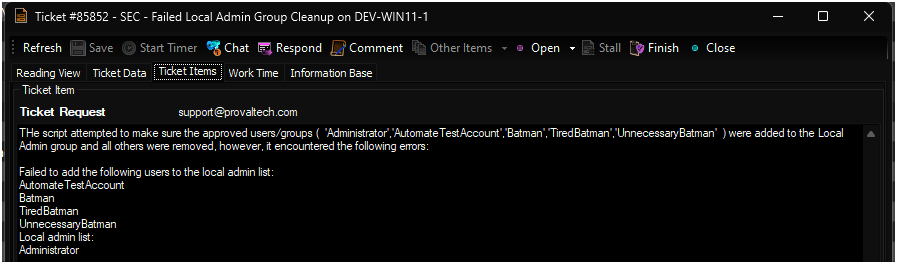
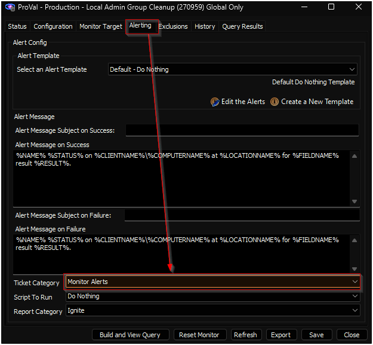

## Summary

This script will remove users other than approved members from the Local Admin group. It will also add those from approved members if they are missing in the Local Admins group. This script will exit if run against a Domain Controller; otherwise, it will execute its normal functionality. The approved local admin group members can be set into the system property and EDFs described further in the document.

The local account `Administrator` and the `Domain Admins` group (if the computer is joined to a domain) will be automatically approved. There is no need to add these entries to the system properties or the EDFs. Additionally, if the [Windows Local Admin Process](<../../solutions/Windows Local Admin Process.md>) is enabled in the environment, the user created by this solution will also be added to the approved list.

**File Path:** `C:/ProgramData/_Automation/Script/LocalAdminCleanup/LocalAdminCleanup.ps1`

**File Hash (SHA256):** `3CAB234347EC753F83D48E90C7CC1591A3DD0FC1EB4912E42921E5ED1370E200`

**File Hash (MD5):** `2E1487B8CA868645BFC711D75024E164`

**Tips:**

- The word `Domain` can be used to define a domain user or group in the exclusion.  
  Example: If the allowed local admin is `"Domain/Domain Users"`, then the script will intelligently add the `"Domain Users"` group to the local admin group for all domain-joined computers.
- Adding `"Domain/Batman, Batman"` to the approved local admin system property will add both the local and domain user `"Batman"` to the local admin group for all domain computers.

## Update Notice: 27-September-2024

The solution's Extra Data Fields have been modified. Update the [Local Admin Group Cleanup - Add/Remove](<./Local Admin Group Cleanup - AddRemove.md>) script from the `Prosync` plugin and run/debug against an online Windows machine with `Set_Environment` as `1` to implement the changes.

## Sample Run

**First Execution:** Run the script against any online Windows computer with the `Set_Environment` parameter set to `1` to create the system properties and the EDFs used by the solution.  

**Regular Execution:**  

## Dependencies

[EPM - User Management - Internal Monitor - Local Admin Group Cleanup](<../monitors/Local Admin Group Cleanup.md>)

## Variables

| Name               | Description                               |
|--------------------|-------------------------------------------|
| ProjectName        | LocalAdminCleanup                         |
| WorkingDirectory    | C:/ProgramData/_Automation/Script/LocalAdminCleanup |
| ScriptPath         | C:/ProgramData/_Automation/Script/LocalAdminCleanup/LocalAdminCleanup.ps1 |

## Global Parameters

| Name            | Value                                                  | Required | Description                                                                                       |
|------------------|--------------------------------------------------------|----------|---------------------------------------------------------------------------------------------------|
| TicketSubject    | SEC - Failed Local Admin Group Cleanup on %Computername% | True     | The subject of the tickets that will be generated from the script for failures.                  |
| MonitorSet       | [ProVal - Production - Local Admin Group Cleanup](https://proval.itglue.com/5078775/docs/16783515) | True     | Name of the monitor set to check for ticket creation.                                            |

## User Parameters

| Name              | Example | Required                       | Description                                                                                      |
|--------------------|---------|--------------------------------|--------------------------------------------------------------------------------------------------|
| Set_Environment     | 1       | Only for the first execution   | Run the script against any online Windows computer with the `Set_Environment` parameter set to `1` to create the system properties and the EDFs used by the solution. |

## System Properties

| Name                               | Example  | Required | Description                                                                                                                                               |
|-------------------------------------|----------|----------|-----------------------------------------------------------------------------------------------------------------------------------------------------------|
| Local_Admin_Group_Approved_Members | Batman   | False    | This field contains a comma-separated list of the approved local admins. If the local admin group cleanup process is enabled for a machine, the usernames set in this system property will be added to the local admin group of all computers in the environment. Avoid setting Domain Users in this system property.  **Example of multiple usernames:** `Batman, UnnecessaryBatman` |

## Client-Level EDF

| Name                          | Example                         | Type      | Section                | Description                                                                                                                                                                                                                                       |
|-------------------------------|---------------------------------|-----------|------------------------|---------------------------------------------------------------------------------------------------------------------------------------------------------------------------------------------------------------------------------------------------|
| 2a. Local Admin Cleanup       | Enabled for Servers and Workstations | Check-Box | Local Admin Account     | Enabling this EDF will ensure that only the 'Approved Local Admins' shown below are added to the Local Admins Group. This will also disable the New Local Admin Monitor.  **Available Options:** <ul><li>Not Enabled</li><li>Enabled for Workstations Only</li><li>Enabled for Servers Only</li><li>Enabled for Servers and Workstations</li></ul>  **Default Option:** Not Enabled  Leaving this EDF blank is equivalent to not enabling the solution for the client.  |
| 2b. Approved Local Admins     | ProValDev/New Batman, TiredBatman | Text     | Local Admin Account     | Comma-separated list of the approved local admins for the client. The value stored in this EDF will be added to the approved list along with the value stored in the `Local_Admin_Group_Approved_Members` system property.  |

## Location-Level EDF

| Name                          | Example | Type      | Section    | Description                                                                                                                                                               |
|-------------------------------|---------|-----------|------------|---------------------------------------------------------------------------------------------------------------------------------------------------------------------------|
| Local Admin Group Cleanup Exclusion | 1/0     | Check-Box | Exclusions | Marking this EDF will exclude the location's computers from the local admin group cleanup process.  |

## Computer-Level EDF

| Name                          | Example                         | Type      | Section | Description                                                                                                                                                               |
|-------------------------------|---------------------------------|-----------|---------|---------------------------------------------------------------------------------------------------------------------------------------------------------------------------|
| Local Admin Group Cleanup Exclusion | 1/0     | Check-Box | Exclusions | Marking this EDF will exclude the computer from the local admin group cleanup process.  |
| Approved Local Admins         | ProValDev/InstantBatman, UnknownBatman | Text      | Default | Comma-separated list of the approved local admins for the computer. The value stored in this EDF will be added to the approved list along with the value stored in the `Local_Admin_Group_Approved_Members` system property and the client-level EDF `2b. Approved Local Admins`.  |

## Output

- Script log
- Ticket (if enabled)

## Ticketing

**Subject:** `SEC - Failed Local Admin Group Cleanup on %Computername%`

**Body:**  
The script attempted to ensure that the approved users/groups (@Approved_Members@) were added to the Local Admin group and all others were removed; however, it encountered the following errors:

`@Scriptoutput@`

**Sample Screenshot:**  
  
  

**Note:** Set a Ticket Category to the [ProVal - Production - Local Admin Group Cleanup](https://proval.itglue.com/5078775/docs/16783515) monitor set to enable the ticket creation feature of the script.  

