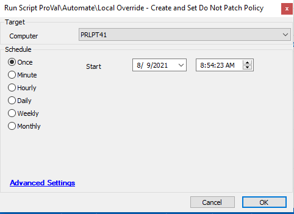

## Summary

The script is useful for setting up local overrides on machines so that they won't be patched.

**Time Saved by Automation:** 15 Minutes

## Sample Run

## Variables

- `@Policy@` - Checks for any existing DO NOT PATCH policy.
- `@CheckPolicy@` - Checks if the policy is successfully created.

## Process

- The script checks for any existing DO NOT PATCH policy, and if it exists, it sets that policy as a local override on the machine.
- If there is no existing patch policy, it creates one and checks whether the policy is successfully created.
- If the policy is successfully created, it sets that policy as a local override.

## Output

- Script log

