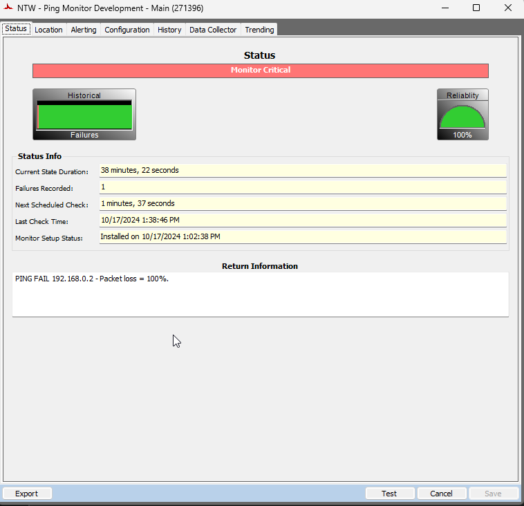
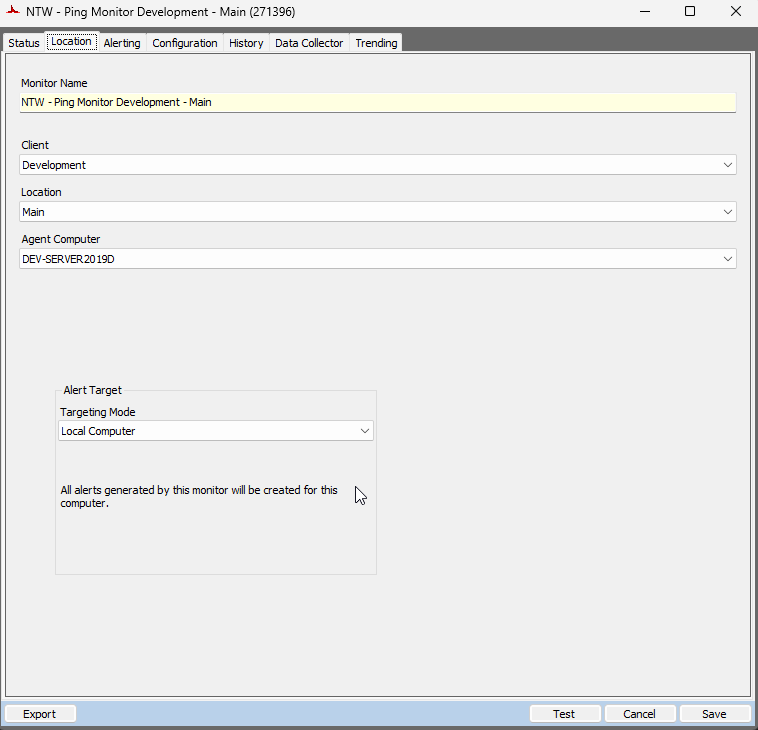
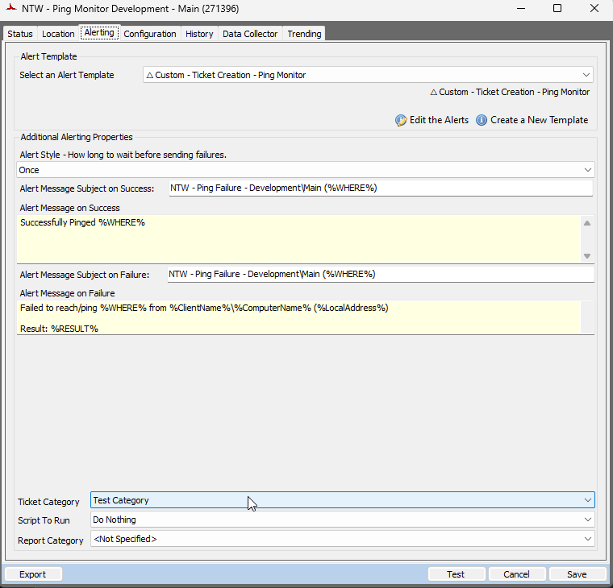
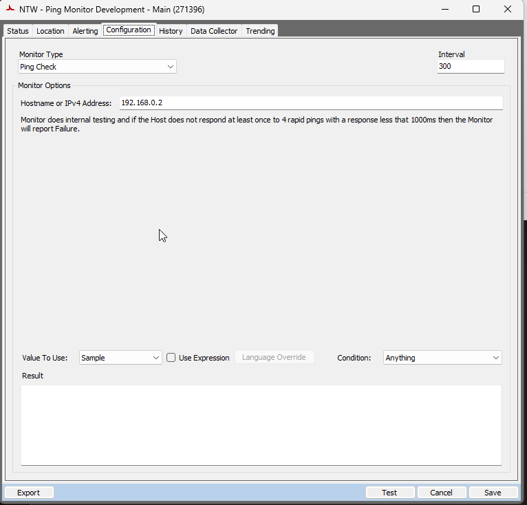

## Summary

This document details the procedure for setting up Remote Monitors for Location Ping Monitors. These monitors are designed to trigger an alert when a location becomes unreachable, meaning the public address of the location is offline. The setup of these remote monitors is controlled by system properties and computer-level Extra Data Fields (EDFs), which are further explained in this document.

#### Notes:
- Locationid `1` is excluded from the monitoring.
- If the location-level EDF `Location_IP_Address` is not set, the ping monitor will be created for the router address used by the maximum number of computers for that location.
- Ping monitors will be created for the computer ID specified in the system property `Location_Ping_Monitor_Computerid`. For on-prem partners, if this system property is not set, the ping monitors will be created on the Automate server.
- The script will send an email to [alerts@provaltech.com](mailto:alerts@provaltech.com) to generate a high-priority ticket in Autotask under the following conditions:
  - If the system property `Location_Ping_Monitor_Computerid` is not set for a hosted partner.
  - If the computer ID specified in the system property `Location_Ping_Monitor_Computerid` does not exist in Automate or is offline.

## Implementation

1. **Remove the `NTW - Ping Monitor <Client Name> - <Location Name>` if exists from the environment to avoid duplicate alerts.**

2. **Import/Update the following content from the `ProSync` plugin:**
   - [Script - Location Ping Monitors - Create](https://proval.itglue.com/5078775/docs/16050276)
   - [Script - Ticket Creation - Ping Monitor](https://proval.itglue.com/DOC-5078775-15313843)
   - Alert Template - △ Custom - Ticket Creation - Ping Monitor

3. **Run/Debug the Script**
   - Execute or debug the script against a single client, with the `Set_Environment` parameter set to `1`. This action will generate the necessary system properties and Extra Data Fields (EDFs) for managing the remote monitors.

4. **Reload System Cache**
   - Refresh the system cache to ensure all changes are updated.

5. **Configure System Properties and EDFs**
   - Navigate to the **System Dashboard → Config → Configurations → Properties**.
   - Set the appropriate alert template and ticket category in their respective system properties for the monitor set.  
   Please read through the detailed System Properties and EDF explanations to understand how to configure any customizations.

6. **Schedule the Script**
   - Schedule the script to run once per day, preferably around midnight, from the dashboard for optimal results.

## Dependencies

[CWM - Automate - Script - Ticket Creation - Ping Monitor](https://proval.itglue.com/DOC-5078775-15313843)

## User Parameters

| Name               | Example | Required                       | Description                                                                                                                                          |
|--------------------|---------|--------------------------------|------------------------------------------------------------------------------------------------------------------------------------------------------|
| Set_Environment     | 1       | True (for first run only)     | Set it to 1 during the first run of the script to generate the necessary system properties and EDFs for managing the generated remote monitors.     |

## System Properties

| Name                                         | Example | Required                      | Description                                                                                                                                                                                                                                      |
|----------------------------------------------|---------|-------------------------------|--------------------------------------------------------------------------------------------------------------------------------------------------------------------------------------------------------------------------------------------------|
| Location_Ping_Monitoring_Alert_Template      | 669     | True                          | This system property stores the id of the `Alert Template` to apply to the remote monitors created for the servers. The default value is the `TemplateID` of the alert template `△ Custom - Ticket Creation - Ping Monitor`.                      |
| Location_Ping_Monitoring_TicketCategory      | 124     | False                         | This system property stores the id of the `Ticket Category` to apply to the remote monitors created. The default value is '0'. i.e., `<Not Specified>`.                                                                                         |
| Location_Ping_Monitor_Computerid             | 900     | True (for hosted partners)   | Ping monitors will be created for the computer ID specified in the system property `Location_Ping_Monitor_Computerid`. For on-prem partners, if this system property is not set, the ping monitors will be created on the Automate server.     |
| Location_Ping_Monitor_Minimum_Computers     | 4       | False                         | The minimum number of computers with matching router addresses required to create a ping monitor. This number is ignored if the IP Address is specified in the location-level EDF `Location_IP_Address`. The default value is 4.                   |

## Client-Level EDF

| Name                                         | Type       | Section                    | Description                                                                                                                                                                                                                                      |
|----------------------------------------------|------------|----------------------------|--------------------------------------------------------------------------------------------------------------------------------------------------------------------------------------------------------------------------------------------------|
| Exclude Client from Location Ping Monitors   | Check Box  | Exclusions                 | Flag this EDF to exclude all locations of the client from the offline location monitoring. Additionally, the existing ping monitor for the location will be removed once this EDF is flagged.                                                |

## Location-Level EDF

| Name                                         | Type       | Section                    | Description                                                                                                                                                                                                                                      |
|----------------------------------------------|------------|----------------------------|--------------------------------------------------------------------------------------------------------------------------------------------------------------------------------------------------------------------------------------------------|
| Location_IP_Address                          | Text       | Location Ping Monitoring    | Public IP to ping. If this EDF is not set, the ping monitor will be created for the router address used by the maximum number of computers for that location.                                                                                  |
| Exclude from Location Ping Monitoring         | Check Box  | Location Ping Monitoring    | Flagging this EDF excludes the location from the monitoring.                                                                                                                                                                                  |

## Remote Monitor Example

**Name:** `NTW - Ping Monitor <Client Name> - <Location Name>`

**Ticket Subject:** `NTW - Ping Failure - <Client Name>/<Location Name> (<Public Address>)`

**Alert Message on Failure:** `Failed to reach/ping <Public Address> from <Client Name of the Computer trying to Ping the Address>/<Name of the computer trying to ping the Address> (<Local Address of the computer trying to ping the address>)`

`Result: %RESULT%`

**Sample Remote Monitor:**

## Output

- Remote Monitors

