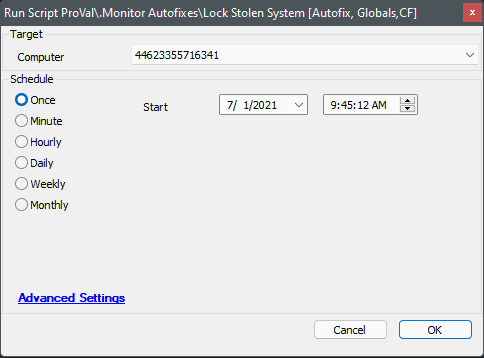
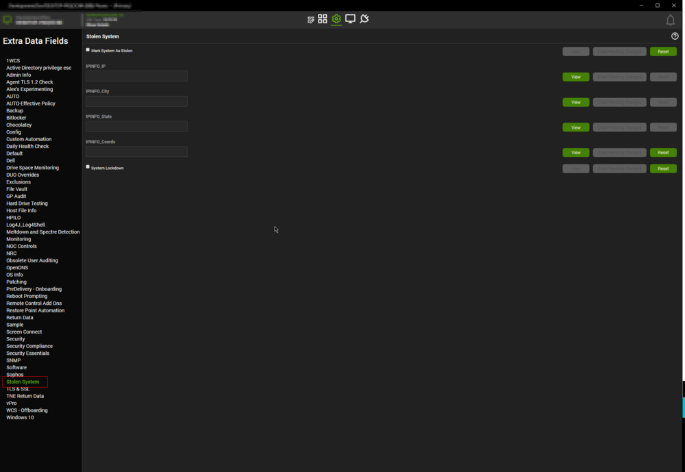

## Summary

This script is used to track and lock down stolen systems. If the computer-level EDF `Stolen Lockdown` is marked, it will enable BitLocker and shut down the computer.

## Sample Run

**Target:** Windows Machine



## Variables

| Name              | Description                                          |
|-------------------|------------------------------------------------------|
| stolen            | Filled by an EDF.                                   |
| SystemLockdown    | Filled by an EDF.                                   |
| NetNeighbors       | Result of Get-NetNeighbor PowerShell                |
| ipconfig          | Result of `ipconfig /all`                           |
| IPINFO            | Result of Get-IPInfo PowerShell                     |
| IPINFOIP         | IP address of the machine                           |
| IPINFOCity       | Current city of the machine according to the IP address |
| IPINFOState      | Current state of the machine according to the IP address |
| IPINFOLoc        | Current coordinates of the computer according to the IP address |
| ImageCurrentUser  | Path to webcam picture taken on the local machine   |
| BitlockerOutput   | Result of PowerShell to enable BitLocker            |

## Global Parameters

| Name                | Example        | Required | Description                                             |
|---------------------|----------------|----------|---------------------------------------------------------|
| BitlockerPassword    | password123!   | True     | The password to use to enable BitLocker on the target machine |
| BitlockerMessage     | This system is owned... | True     | The message to display on the BitLocker lock screen.   |

## EDFs

| Name                       | Type       | Required | Description                                                                                     |
|----------------------------|------------|----------|-------------------------------------------------------------------------------------------------|
| Mark System As Stolen      | Check Box  | True     | Primary EDF to enable the solution. Check this EDF to mark a computer as stolen.               |
| System Lockdown             | Check Box  | True     | Mark this EDF to lock down the computer once it comes online. The script will not enable BitLocker and shut down the computer if this EDF is unchecked. |
| IPINFO_IP                  | Text Box   | True     | Current IP address of the machine, saved by the script.                                       |
| IPINFO_City                | Text Box   | True     | Current city of the machine according to the IP address                                       |
| IPINFO_State               | Text Box   | True     | Current state of the machine according to the IP address                                      |
| IPINFO_Coords             | Text Box   | True     | Current coordinates of the computer according to the IP address                               |



## Output

- Script log
- Ticket
- LTShare files
- EDFs

## Ticketing

**Subject:** `Lost or stolen system %computername% at %clientname% has come online!`

**Ticket Body:** `The script Lock Stolen System is currently running against the device and will attempt to find the location of the machine, attempt to BitLocker the device, and attempt to take a photo from any onboard webcams.`

**Ticket Comment:**

```
The system has been encrypted with BitLocker to prevent data theft.
PW: @BitlockerPassword@

Information Gathered!

Ipconfig:
@ipconfig@

NetNeighbors if available:
@netneighbors@

WebCamImage:
@ImageCurrentUser@

The script is using the shutdown command, so the machine will become unusable without the BitLocker key.
```

