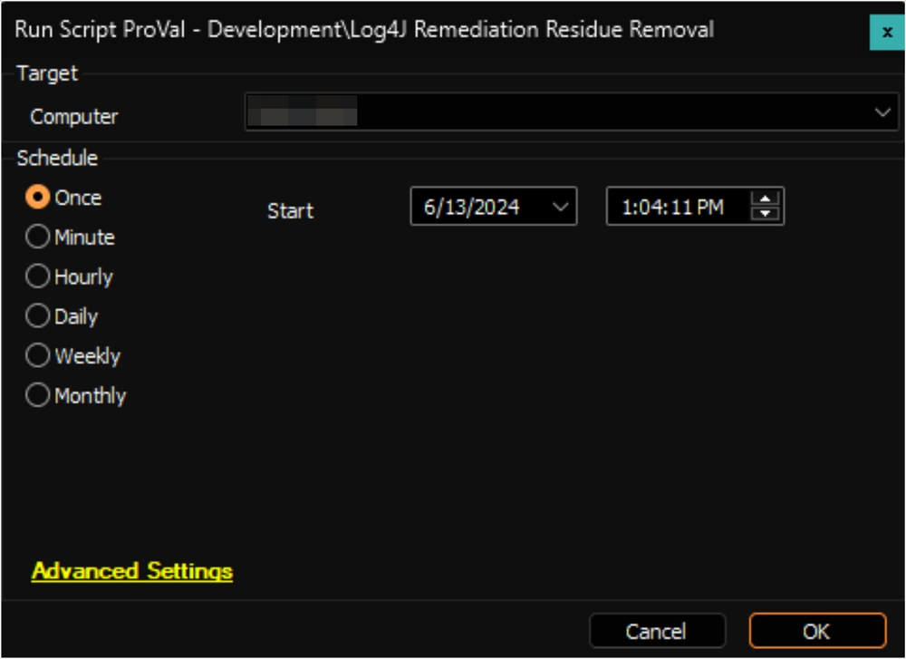

## Summary

The script removes the residuals left by the [Log4J (Log4Shell) File Scan](<./Log4J (Log4Shell) File Scan.md>) script, including the `Everything` service.

## Sample Run

## Dependencies

[SEC - Endpoint Protection - Script - Log4J (Log4Shell) File Scan](<./Log4J (Log4Shell) File Scan.md>)
