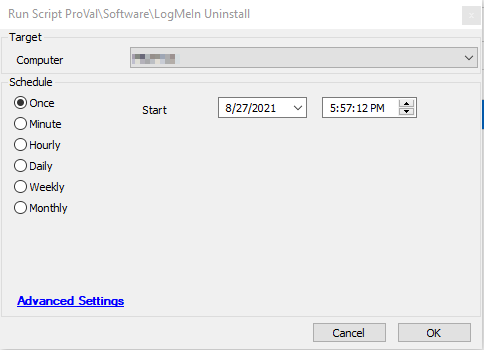

## Summary

This script will fetch the uninstall string from the DB and attempt to uninstall LogMeIn from the target machine.  
Time Saved by Automation: 5 Minutes

## Sample Run

## Process

- Runs SQL query to fetch uninstall string for all the LogMeIn clients found in the database.
- Sequentially runs shell command to uninstall all the LogMeIn clients using their respective uninstallation string.

## Output

- Script log

