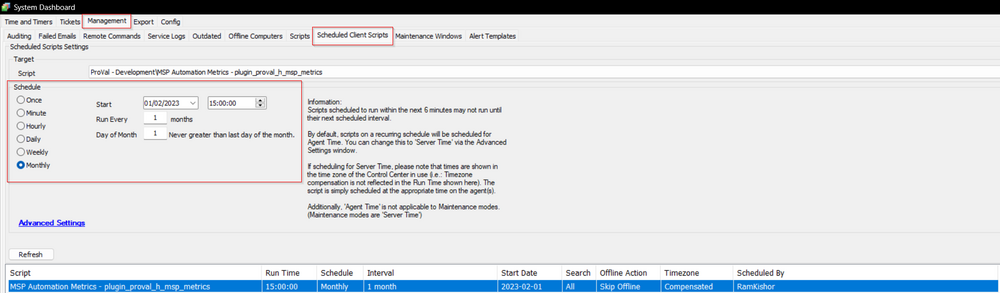

## Summary

This script creates and populates data to the plugin_proval_h_msp_metrics custom table. At this time the Splitting variables step is currently set to disabled as it has no current use; once the future development of the request is satisfied, we can enable that step.

## Sample Run

Please schedule the script to run on the second Monday of each month. This is a client-based script and needs to be scheduled in the system dashboard. The details from the script run can be found in the accompanying dataview in the related items section.

## Variables

| Name                           | Description                                                       |
|--------------------------------|-------------------------------------------------------------------|
| Automate_Variables            | Output of the SQL query to extract the rest of the variables      |
| DateTime                      | Date the metrics were gathered                                    |
| Agents                        | Total Agent Count                                                |
| Agents_Online_30_Days        | Total Agent Count online last 30 days                            |
| Servers                       | Total Servers Count                                              |
| Workstations                  | Total Workstations Count                                         |
| Windows                       | Total Windows Count                                              |
| Non_Windows                   | Total Non-Windows Count                                          |
| Servers_Patching              | Total Servers in Patching                                        |
| Workstations_Patching         | Total Workstations in Patching                                   |
| Servers_Missing_Patches       | Total Missing Patches for Servers in Patching                    |
| Workstations_Missing_Patches   | Total Missing Patches for Workstations in Patching               |
| Tickets_30_Days               | Total Tickets generated by the RMM in the last 30 days          |
| Time_Saved_All_Scripts       | Total time saved by automation in the last 30 days - All Scripts In Minutes |
| Time_Saved_ProVal_Scripts    | Total time saved by automation in the last 30 days - ProVal scripts In Minutes |

## Process

- Executes a SQL query to create the custom table and to fetch the data into the script. 
- Split the `Automate_Variables` to set the rest of the variables. 

## Output

- Custom Table
- Dataview

