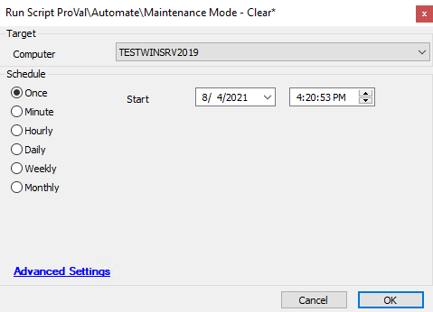

## Summary

This script allows you to bulk-clear Maintenance mode or schedule it to be cleared at a set time.

**Time Saved by Automation:** 5 Minutes

## Sample Run

## Variables

- `%computerid%` - Computer ID of the target machine

## Process

The script will execute the command to remove Maintenance mode from the target machine(s).

## Output

- Script log

