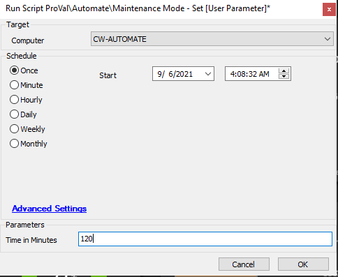

## Summary

This script sets maintenance mode on the target agent.

**Time Saved by Automation:** 5 Minutes

## Sample Run

### User Parameters

| Name                | Example | Required | Description                                                                 |
|---------------------|---------|----------|-----------------------------------------------------------------------------|
| Time In Minutes     | 300     | True     | The number of minutes to set for maintenance mode. Max 99999.             |

## Process

The script starts maintenance mode with a prompt for how long to set it. Please specify the time when running the script. The maximum time allowed is 99999 minutes. Any number larger than that will cause the script to error out.

## Output

- Script log
