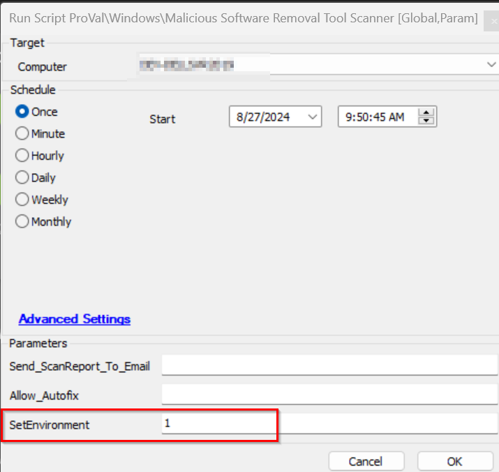
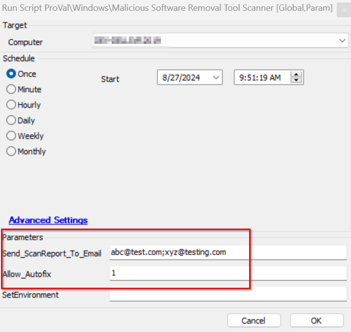

## Summary

This script will download and run the latest version of the Microsoft Malicious Software Removal Tool Scanner and log and email the result to the specified email address. It also provides an option to perform the autofix of the detected infection by the tool.

Please get the below file hash approved for this script to work if the environment has a security block application:

- `ED06AECD5686944B0A5E5D76C1E7A9EA` --> Audit MSRT.ps1 script
- `C8759C7E4979819C0BB39DAF4DC64124` --> MSRTAutofix.ps1 script

## Sample Run

Run with `SetEnvironment = 1`, to set the EDFs at the very first time of importing this script,

After the SetEnvironment is set, please refer to the sample execution.

## Variables

| Name        | Description                                         |
|-------------|-----------------------------------------------------|
| ScanResult  | This stores the Scan result of the Malicious Removal Software Tool. |

## EDF

| Name                     | Level   | Type  | Editable | Description                                                                                                                                               |
|--------------------------|---------|-------|----------|-----------------------------------------------------------------------------------------------------------------------------------------------------------|
| MSRT Scanner Enable      | Client  | Flag  | Yes      | This EDF check will enable the MSRT scan automation via the [Internal Monitor - MSRT Scanner Execute](https://proval.itglue.com/DOC-5078775-16504099). |
| MSRT Scanner Exclude     | Location| Flag  | Yes      | This EDF check will exclude the location from the MSRT scan automation via the [Internal Monitor - MSRT Scanner Execute](https://proval.itglue.com/DOC-5078775-16504099). |
| MSRT Scanner Exclude     | Computer| Flag  | Yes      | This EDF check will exclude the computer from the MSRT scan automation via the [Internal Monitor - MSRT Scanner Execute](https://proval.itglue.com/DOC-5078775-16504099). |
| MSRT Scanner Result      | Client  | Text  | No       | This EDF stores the scan result conclusive output and date when the scanning happened in the format example: "Infection Not Found -- M/DD/YYYY hh:mm:ss". |

#### User Parameters

| Name                        | Example                                                 | Required | Description                                                                                                                                                                                                                       |
|-----------------------------|---------------------------------------------------------|----------|-----------------------------------------------------------------------------------------------------------------------------------------------------------------------------------------------------------------------------------|
| Send_ScanReport_To_Email    | [abc@test.com](mailto:abc@test.com); [xyz@test.com](mailto:xyz@test.com) | False    | This stores the email address of the user to whom the scan report of MSRT needed to be sent. Use a semicolon (;) to separate multiple email addresses so that a report can be sent to multiple users at a time.                   |
| Allow_Autofix               | 1                                                       | False    | If this user parameter is set to 1, then if the infection is detected then the MSRT /F:Y (force scan and automatic cleaning of infection will be scheduled).                                                                       |
| SetEnvironment               | 1                                                       | False    | If this is set, then it will get the EDFs imported.                                                                                                                                                                            |

## Global Parameter

| Name                          | Example | Required | Description                                                                                                                                               |
|-------------------------------|---------|----------|-----------------------------------------------------------------------------------------------------------------------------------------------------------|
| Email_On_No_Infection         | 1 or 0  | False    | If it is set to 1, then the user will get the email sent for the no infection message with the attached report.                                         |

## Output

- Script log
- Local file on the computer `C:/WINDOWS/debug/mrt.log`

