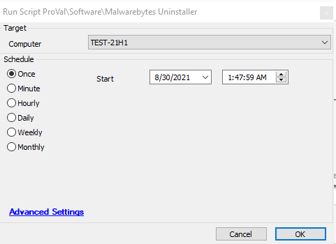

## Summary

This script downloads an uninstaller tool directly from the Malwarebytes webpage and attempts to uninstall Malwarebytes from the target machine.

**Time Saved by Automation:** 5 Minutes

## Sample Run

## Process

This script will download an uninstaller tool directly from the Malwarebytes webpage and then attempt to uninstall Malwarebytes from the target machine. The script first verifies if Malwarebytes is installed; if it is, the script will proceed to uninstall it from the target machine by executing several shell commands. Additionally, the script verifies whether Malwarebytes was successfully uninstalled from the target machine.

## Output

- Script log
