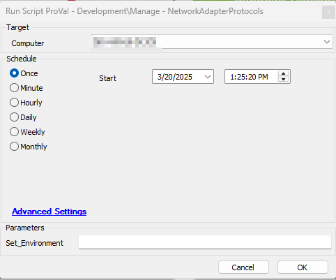
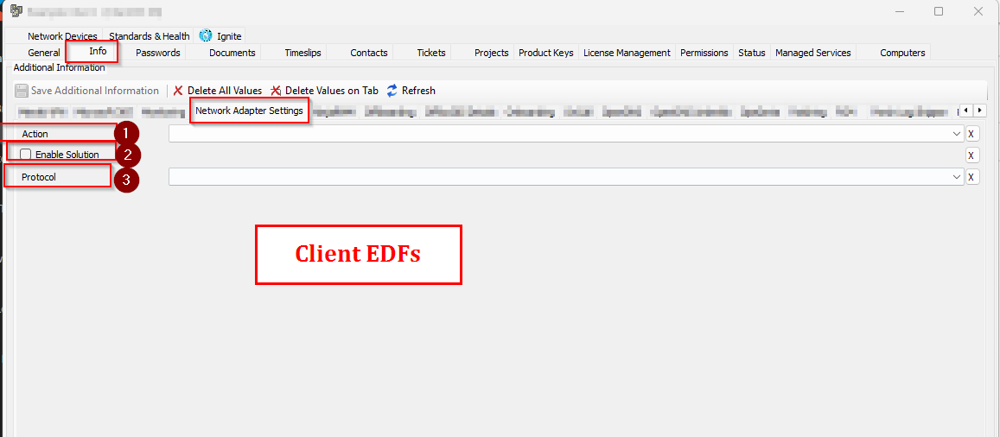
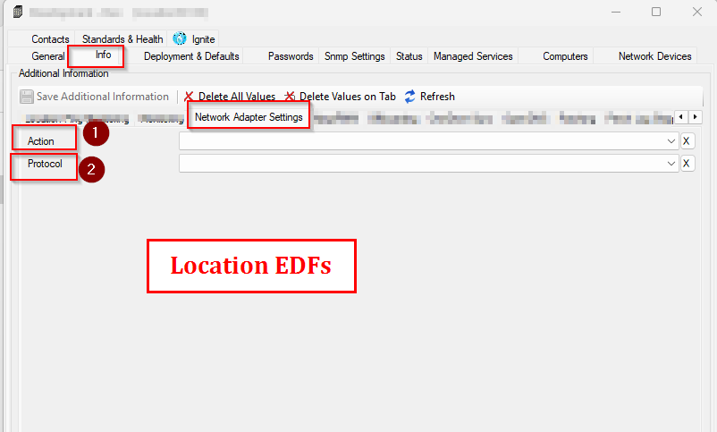
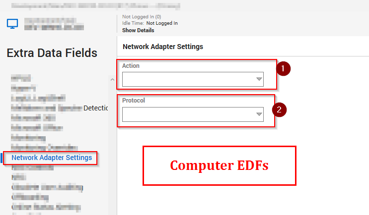

## Summary
This script allows you to manage network protocols on Windows machines, including enabling, disabling, and configuring them to use DHCP.

**Caution** 
Use this script with caution. Disabling IPv4 on the machine may result in a network disconnection.

## Dependencies

- [Internal Monitor : ProVal - Production - Manage Network Adapters](<../monitors/Manage-Network-Adapters.md>)
- [Solution : Manage-NetworkAdapterProtocols](<../../solutions/Manage_Network_Protocols.md>)

## Sample Run
 

## User Parameters

| Name     | Example                                         | Required | Description                                         |
|----------|-------------------------------------------------|----------|-----------------------------------------------------|
| Set_Environment  | 1 | True (For First execution)   | Set to '1' to create the EDFs if they are not already created in the environment. This must be set to '1' for the first execution.|

## EDFs

| Name             | Level  | Type     | Example | Section | Description                                |
|------------------|--------|----------|---------|---------|--------------------------------------------|
| Enable Solution  | Client | Checkbox | -       | Network Adapter Settings   | Select it to enable the solution on the Client |
| Action | Client | Dropdown | <ui><li>ENABLE<li>DISABLE<li>Enable DHCP</ui> | Network Adapter Settings   | Set it to `Enable` to enable a protocol, `Disable` to disable a protocol, `Enable DHCP` to configure a protocol to use DHCP |
| Protocol | Client | Dropdown | <ui><li>IPv4<li>IPv6<li>Both</ui> | Network Adapter Settings   | Select `IPv4` to perform the above action on IPv4, `IPv6` to perform the above action on IPv6, `Both` to perform action on both IPv4 and IPv6. ***`Both` option is not supported with the `Disable` action, as both protocols cannot be disabled simultaneously*** |
| Action | Location | Dropdown | <ui><li>ENABLE<li>DISABLE<li>Enable DHCP<li>Exclude From Solution</ui>    | Network Adapter Settings   | Location override for `Action`. Set it to `Exclude From Solution` to exclude Location from the solution. Script will prefer location `Action` over Client `Action` for the location |
| Protocol | Location | Dropdown | <ui><li>IPv4<li>IPv6<li>Both</ui>  | Network Adapter Settings   | Location override for `Protocol`. Script will prefer location `Protocol` over Client `Protocol` for the location |
| Action | Computer | Dropdown | <ui><li>ENABLE<li>DISABLE<li>Enable DHCP<li>Exclude From Solution</ui>   | Network Adapter Settings   | Computer override for `Action`. Set it to `Exclude From Solution` to exclude Computer from the solution. Script will prefer Computer `Action` over Client/Location `Action` for the Computer |
| Protocol | Computer | Dropdown | <ui><li>IPv4<li>IPv6<li>Both</ui>  | Network Adapter Settings   | Computer override for `Protocol`.  Script will prefer Computer `Protocol` over Client/Location `Protocol` for the Computer  |

### Client EDFs
 

 ### Location EDFs
 

 ### Computer EDFs
 

## Output
- Script Logs