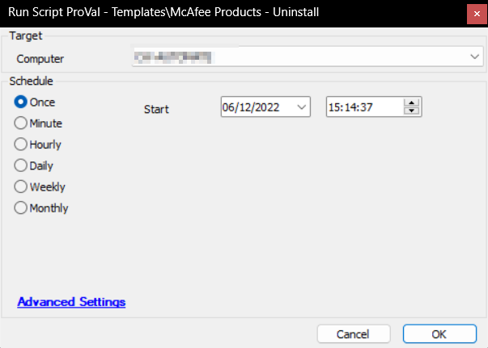

## Summary

This script is an Automate implementation of the agnostic solution [SWM - Software Uninstall - Agnostic - Remove-McAfeeSoftware](<../../powershell/Remove-McAfeeSoftware.md>) to remove McAfee products from Windows machines.

## Sample Run

## Dependencies

[SWM - Software Uninstall - Agnostic - Remove-McAfeeSoftware](<../../powershell/Remove-McAfeeSoftware.md>)

## Process

- Verify the presence of the script.
- Attempt to remove the application(s).
- Verify the outcome of the uninstallation and generate logs accordingly.

## Output

- Script Log

