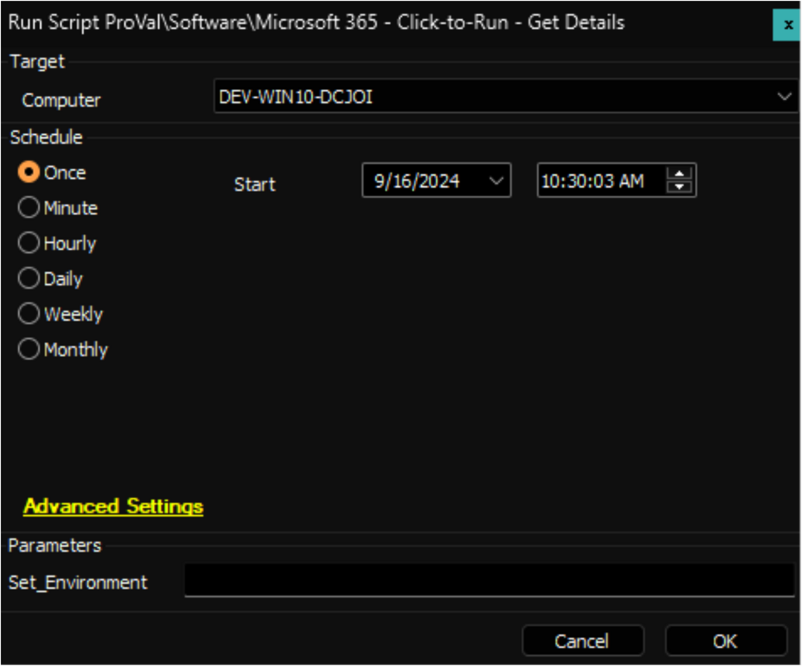

## Summary

This script retrieves the installed Microsoft Click-to-Run Office version on the machine, verifies whether auto-update is enabled, and obtains the Update channel. It then stores this information in the custom table [pvl_m365_update_channel_audit](https://proval.itglue.com/DOC-5078775-17164846).

File Path: `C:/ProgramData/_Automation/Script/Get-M365UpdateChannel/Get-M365UpdateChannel.ps1`  
File Hash (SHA256): `1CAED911E914A8F8C9EBA29D244459F4DA2B09780EB8ED720FB55F2519E06D19`  
File Hash (MD5): `E58115561CA743E1D9BCF56CAF13C839`  

## Sample Run

**First Run:** Execute the script against any online Windows machine with the `Set_Environment` parameter set to `1` to create the custom table and EDFs used by the solution.

**Regular Run:**  

## Client Level EDF

| Name            | Example          | Type      | Section        | Details                                                                                                                                       |
|-----------------|------------------|-----------|----------------|-----------------------------------------------------------------------------------------------------------------------------------------------|
| Update Channel   | Current Channel  | DropDown  | Microsoft 365  | Select the Update Channel from the drop-down menu to set for the client's computers. Available options are: \<ul>\<li>Current Channel\</li>\<li>Monthly Enterprise Channel\</li>\<li>Semi-Annual Enterprise Channel\</li>\<li>Beta Channel\</li>\<li>None\</li>\</ul> Leave it blank or set it to `None` to disable the Automation for the client. |

**Note:** The EDF is used by [Microsoft 365 - Set Update Channel - Current](https://proval.itglue.com/DOC-5078775-8181470) script and [Microsoft 365 - Click-to-Run - Set Update Channel](https://proval.itglue.com/DOC-5078775-17164734) internal monitor.

## Computer Level EDF

| Name            | Example          | Type      | Section        | Details                                                                                                                                       |
|-----------------|------------------|-----------|----------------|-----------------------------------------------------------------------------------------------------------------------------------------------|
| Update Channel   | Current Channel  | DropDown  | Microsoft 365  | Select the Update Channel from the drop-down menu to set for the computer. Available options are: \<ul>\<li>Current Channel\</li>\<li>Monthly Enterprise Channel\</li>\<li>Semi-Annual Enterprise Channel\</li>\<li>Beta Channel\</li>\<li>None\</li>\</ul> Set it to `None` to disable the Automation for the computer. Computer Level EDF can be used to override the value set in the Client Level EDF. |

**Note:** The EDF is used by [Microsoft 365 - Set Update Channel - Current](https://proval.itglue.com/DOC-5078775-8181470) script and [Microsoft 365 - Click-to-Run - Set Update Channel](https://proval.itglue.com/DOC-5078775-17164734) internal monitor.

## Output

- Script log
- Custom Table
- Dataview

