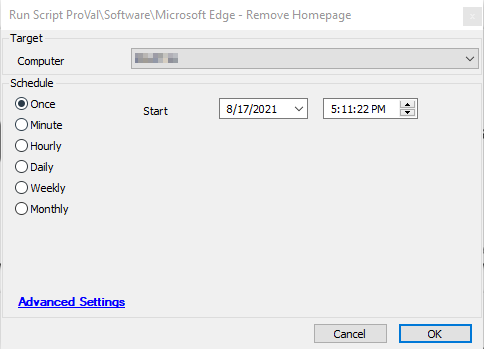

## Summary

This script is used to remove the enforcement of a homepage in the Edge browser.

**Time Saved by Automation:** 5 Minutes

## Sample Run



## Dependencies

- [Remove-EdgeHomepage](https://proval.itglue.com/DOC-5078775-7348071)

## Process

1. First, it downloads the `.ps1` file from [this link](https://file.provaltech.com/repo/script/Remove-EdgeHomepage.ps1).
2. Executes the downloaded `.ps1` file.
3. This PowerShell script will scan for and remove all homepage policies from the Windows registry.

## Output

The results of the script can be found in the `-log.txt` file generated by the script, located in the same directory as the script.

```
./Remove-EdgeHomepage-log.txt
```


