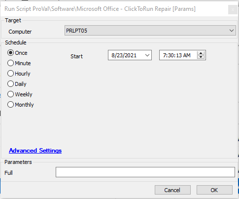

## Summary

This script runs a repair on office products; by default, it will perform a quick repair, but you can run a full repair by filling the user parameter "Full" to 1.  
Time Saved by Automation: 5 Minutes

## Sample Run

## Dependencies

- Applicable to ClickToRun versions

## Variables

`%powershellresult%` - Used to track office bit version either 32 or 64.

#### User Parameters

| Name  | Example | Required | Description                                |
|-------|---------|----------|--------------------------------------------|
| Full  | 1       | False    | Runs a full office repair on the system    |

## Process

- Checks if `clicktorun.exe` is present on the system or not.
- If the script finds the exe, then it checks whether the office installed is 32 bit or 64 bit.
- Depending on the bit version, checks if user parameter "Full" is set to 1; if it's set, then it runs a full repair.
- By default, runs a quick repair on the machine.

## Output

- Script log

