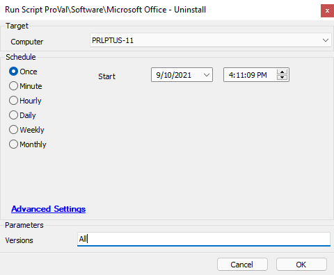

## Summary

This script will run the Office Scrub utility and remove all or specified Microsoft Office products.

Time Saved by Automation: 20 Minutes

## Sample Run

See parameters in the below "User Parameters" section

## Dependencies

[Invoke-OffScrub](<../../powershell/Invoke-OfficeScrub.md>) (PowerShell script)

## Variables

- `@ProjectName@` - The name of the PowerShell script that will perform the desired actions
- `@Parameters@` - Handles parameters passed to the PowerShell script
- `@Versions@` - Handles which versions of Microsoft Office will attempt to uninstall

Please see [Invoke-OffScrub](<../../powershell/Invoke-OfficeScrub.md>) to review remaining variables.

#### User Parameters

| Name        | Example | Required | Description                                                                                       |
|-------------|---------|----------|---------------------------------------------------------------------------------------------------|
| `@Versions@`| All     | True     | This is the user parameter used to determine which versions of office will attempt to uninstall.  Parameters:  All - Will attempt to remove all Microsoft Office products  2003 - Will attempt to remove Microsoft Office 2003  2007 - Will attempt to remove Microsoft Office 2007  2010 - Will attempt to remove Microsoft Office 2010  2013 - Will attempt to remove Microsoft Office 2013  2016 - Will attempt to remove Microsoft Office 2016  365 - Will attempt to remove Microsoft Office 365 |

## Process

The script will determine which version(s) of Microsoft Office to uninstall via the user parameter `@Versions@`.

Based on the version input by the technician, the script will jump to the appropriate section of the script and execute the OfficeScrub payload in this Automate script. The script will run through the various versions and report back success/fail information back to the Automate script. There are additional logs available on the endpoint (please see the [Invoke-OffScrub](<../../powershell/Invoke-OfficeScrub.md>) documentation for details on log locations.)

## Output

- Script log
- Local file on computer

