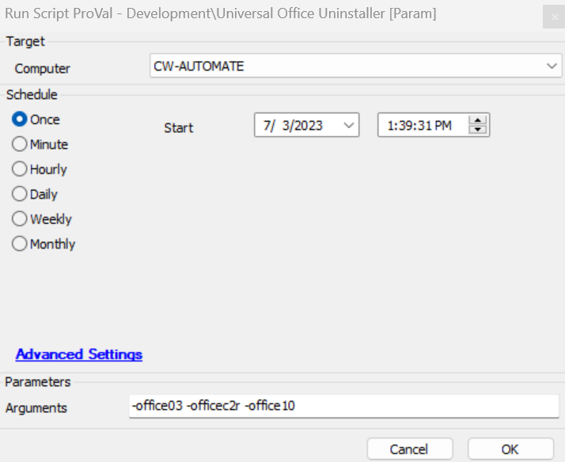

## Summary

This script downloads the offscrub files from the repository and then attempts to uninstall all versions of Microsoft Office from 2007 to 2016 & O365. It can handle machine or software corruption and completely removes Office app shortcuts for the version.

## Sample Run

## Dependencies

[SWM - Software Uninstall - Invoke-OfficeScrub](<../../powershell/Invoke-OfficeScrub.md>)

## Variables

| Name       | Description                                                                                                                                   |
|------------|-----------------------------------------------------------------------------------------------------------------------------------------------|
| Parameters | This contains the user input for the Arguments parameter. If Arguments is empty, it sets it to -All; otherwise, the argument is passed to the uninstallation of the desired Office application. |

### User Parameters

| Name      | Example | Required | Description                                                                                                                                   |
|-----------|---------|----------|-----------------------------------------------------------------------------------------------------------------------------------------------|
| Arguments | -All   | False    | This parameter accepts user input for the different Office uninstallation based on the argument list provided in the agnostic solution. |

## Implementation

This script is designed to run manually on Windows machines as per requirement. It can uninstall any variant of Office based on the arguments passed to it. This script can be run at any time as it is completely silent, and no restart is required after its completion.

## Output

- Script log  
- Local file on computer
