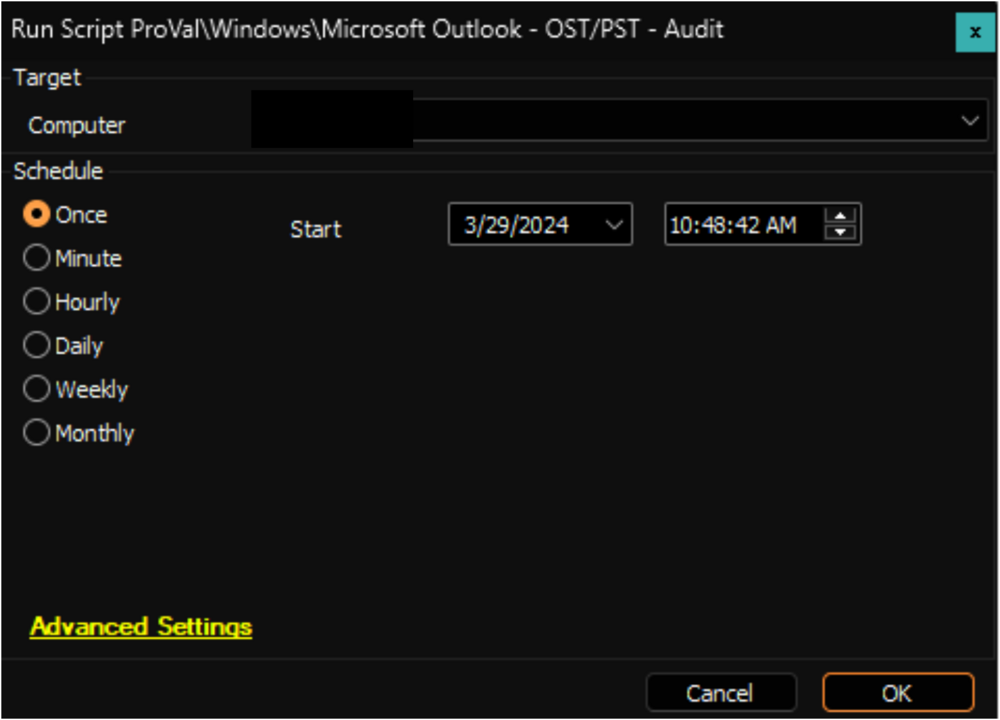

## Summary

This script collects all the OST/PST file names and sizes from the Windows machines and stores it into a custom table [EPM - Data Collection - Custom Table - pvl_outlook_pst_ost_audit](https://proval.itglue.com/DOC-5078775-15595946).

Script Path: C:/Programdata/_Automation/Script/Audit-OutlookDB/Audit-OutlookDB.ps1  
File Hash: B5689044612005060B790DFC5560C8E28E44B82BDE107D971AA146B91F147881

## Sample Run

## Dependencies

[EPM - Data Collection - Internal Monitor - Execute Script - Microsoft Outlook - OST/PST - Audit](https://proval.itglue.com/DOC-5078775-15490756)

## Output

- Script log
- Dataview

